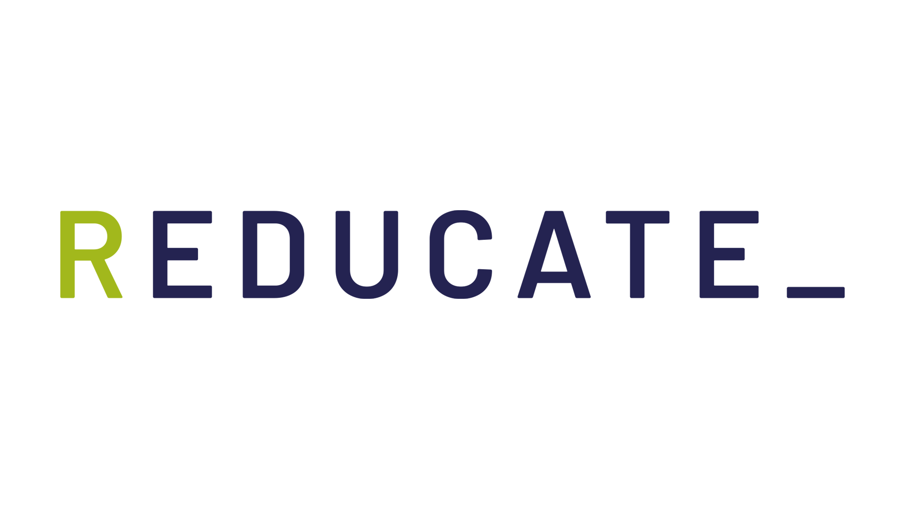

## File: Initial Implementation Plan - AI-Driven Document Compliance Analysis System (3).pdf


## Page 1
Updated Initial Implementation Plan 
AI-Driven Document Compliance Analysis 
System 
Project Overview 
This project aims to develop a Streamlit-based AI-powered application that allows businesses to 
upload internal documents, select a compliance standard (e.g., ISO 9001, ISO 27001, GDPR), 
and receive a detailed compliance report. The report will: 
●​
Identify what aligns with the selected standard​
●​
Highlight gaps with actionable recommendations​
To ensure output quality, a multi-agent architecture will be implemented, where a team of AI 
agents generates the initial report, and another team reviews it before final output using an 
automated feedback loop. 
Milestones & Timeline 
Milestone 1: Frontend Development (Streamlit UI) 
Timeline: Day 1 – Day 5 
Scope: 
●​
Develop the user interface using Streamlit​
●​
File upload component supporting PDF, DOCX, TXT​
●​
Dropdown menu for compliance standard selection​
●​
Button to trigger analysis​
●​
Loading indicators and result display area​


## Page 2
●​
Basic input validation​
Deliverables: 
●​
Fully functional Streamlit-based UI​
●​
Input form with validation and standard selection​
●​
Result panel for displaying compliance insights​
●​
GitHub repository with frontend code​
Milestone 2: AI Agents Development & Feedback Loop Integration 
Timeline: Day 6 – Day 19 (includes 5-day extension) 
Scope: 
●​
Design and implement two agent teams:​
○​
Report Generation Agents: Analyze content and generate compliance insights​
○​
Review Agents: Independently verify the generated report​
●​
Establish a feedback loop: If inconsistencies are found, report is sent back to
generation agents for revision​
●​
Prompt templates aligned with ISO/GDPR requirements​
●​
Modular architecture using LangChain or CrewAI​
Deliverables: 
●​
Modular AI agent system (generation + review teams)​
●​
Feedback loop logic implemented and tested​
●​
Prompt templates for selected standards​


## Page 3
●​
Evaluation mechanism for agents' review quality​
●​
Logs for agent decisions and actions​
●​
GitHub repository with all agent logic and configuration​
Milestone 3: Backend Integration 
Timeline: Day 20 – Day 24 
Scope: 
●​
Document preprocessing: parsing, text extraction, and chunking​
●​
Connect frontend to AI agent backend​
●​
Generate structured, exportable reports (HTML/PDF)​
●​
In-memory file handling for privacy​
Deliverables: 
●​
Preprocessing pipeline for uploaded files​
●​
End-to-end integration (upload → analyze → report)​
●​
Downloadable compliance report (PDF or HTML)​
●​
Complete backend scripts in GitHub repository​
Milestone 4: Deployment & Testing 
Timeline: Day 25 – Day 30 (updated project duration) 
Scope: 


## Page 4
●​
Deploy app on Streamlit Community Cloud​
●​
Perform usability, performance, and functional testing​
●​
Final QA and adjustments based on test feedback​
●​
Deliver technical documentation and usage guide​
Deliverables: 
●​
Live deployed app with public access URL​
●​
QA test logs (including edge case tests)​
●​
Final project documentation​
●​
User onboarding guide or instructions​
●​
Deployment link and repository access
3. Tools, Frameworks, and APIs
Component 
Tools / Libraries 
UI 
Streamlit 
Document 
Parsing 
pdfminer.six, python-docx, 
PyMuPDF 
LLM Integration 
OpenAI GPT-4 API 
Agent Framework 
LangChain or CrewAI 
Report 
Generation 
HTML templates, pdfkit or 
reportlab 
Deployment 
Streamlit Community Cloud 


## Page 5
7. Success Criteria
●​
Frontend Usability: Smooth file upload, clean interface, intuitive standard selection​
●​
AI Accuracy: ≥90% alignment to real compliance content (validated by manual reviews)​
●​
Processing Speed: ≤90 seconds for a document of up to 10 pages​
●​
User Feedback: ≥4.5/5 average rating on report clarity and usefulness​
●​
Deployment Uptime: ≥99% availability during test period​


---

## File: Information Security Policy [Internal].docx

Information Security Policy [Internal]

Confidentiality Statement:

The information contained in this document is privileged and confidential and protected from disclosure outside Reducate. The recipient is hereby notified that any dissemination, distribution or copying of this  communication is strictly prohibited without the prior written approval from the director of Reducate hereafter Reviewer in this document.

This document details the policies and standards for the information security of Reducate. Hereafter referred to as Reducate. These policies will be based on ISO27001 standards.

We understand that compliance with the security policy and standards is expected for all organisational  units, information systems and communication systems. Any control deficiency in any of the IT systems or  non-compliance with the security policy may adversely affect the operation of the organisation.

It is the responsibility of all individuals (Employees and Contractors) at Reducate to comply with these policies. This policy revision 1.0 will come into effect from 13-06-2022.

Name: Stephan Csorba

Designation: Stephan Csorba

Signature: ___________________

Date: _______________________

Chapter 1 General

IT is critical to Reducate. It is of paramount importance to ensure the faultless availability of its information systems and the confidentiality and integrity of the data contained therein. This document lists the security policies and standards for Reducate.

This policy defines "baseline" control measures, which Reducate is expected to be familiar with and to consistently follow. These security measures are the minimum required to prevent a variety of different problems including: fraud, malware, sabotage, errors and omissions, as well as system unavailability. This document also defines the minimum controls necessary to prevent legal problems such as allegations of negligence or privacy violation.

Section - 1.1 Scope of the policy

This Information Security Policy applies to the acquisition, transfer and transmission, use and processing, storage and backup, deletion and disposal, etc., of various types of information, including documents, electronic data, and verbal statements, etc. In addition, these rules also apply to all facilities and environments related to the information assets. Furthermore, the information system includes all equipment, hardware and software, applications, and data stores of the IT infrastructure.

These rules apply to all employees and dispatched workers who access the information assets, including our officers, regular workers, temporary workers, part-time workers, etc. In addition, in the case of outsourcing, the security management level required by this policy is to be ensured.

Section - 1.2 Assumptions

This document assumes that:

All managerial decisions regarding IT policy matters are performed from Reducate

The existing infrastructure of E-WISE Netherlands as of 01-01-2022 is the baseline on which all policies have been reviewed.

Section - 1.3 Intended Audience

Each chapter will outline the objective and intended audience

High Level Managers – Managing director and board of directors who need to understand some of the security risks and implications of managed services from Reducate, so that they can appropriately allocate resources and delegate responsibility.

Middle Level Managers – IT Managers and business managers, who will need to understand issue-specific policies.

Engineers / developers - Reducate technical support people who need to understand the policy roots of the technical controls they will be asked to implement and the activities that need to be performed to ensure the security of the information systems. This will include other support contractors and engineers employed by Reducate.

Users – All employees and contractors.

Section - 1.4 Enforcements

This policy will come into effect after approval by the director of Reducate.

The director of Reducate is the owner of the security policy and any changes to the document have to be authorised by the director or their designate.

Section - 1.5 Roles and Responsibilities

(ISO 27001: 2013-A18.2.2, 2022-A5.36)

Reducate and group companies management must ensure segregation of duties when assigning responsibilities.

Reducate:

CEO – Responsible for information security and that must secure appropriate resource allocation in the implementation of this policy.

Competences: Risk conscious, Security conscious, Trustworthy

Information Security Steering Committee (ISSC) – ISSC is to be held annually to define a global direction for information security management and to support resource allocation and implementation on behalf of the CEO of Reducate. The Reducate ISSC consists of the CFO and CTO of Reducate.

Competences: Risk conscious, Responsible, Security conscious, Trustworthy, Meticulous, Control

Organisational units/sites:

Operational director – Report yearly to ISSC

Competences: Risk conscious, Security conscious, Trustworthy, Control

Information Security Working Group (ISWG) – ISWG is to be periodically held to define a direction for local information security management and to support resource allocation and implementation on behalf of the director of the local organisational unit/site.

Competences: Risk conscious, Responsible, Security conscious, Trustworthy, Meticulous

IT Asset Managers – Classify and manage information assets and maintain the updated inventory of information assets. Responsible for identifying the value of information they hold and for securing the confidentiality, integrity, and availability thereof.

Competences: Risk conscious, Security conscious, Trustworthy

Managers – Responsible for making their subordinate staff aware of compliance with this policy. Managers are responsible for managing the appropriate use of the information system by the staff.

Competences: Risk conscious, Security conscious, Trustworthy

Users – Responsible for fully understanding this information security policy, related rules, etc., and for complying with the same.

Competences: Risk conscious, Security conscious, Trustworthy

Executive responsibilities:

Determine security objectives

Alignment with business strategy to meet the organisation’s strategic objectives

Effective and efficient resource management

Set clear policies around information security

Carry out training and awareness programs

Review all activities

Organise the implementation

Ensure continuous information security

(ISO 27001: 2013-A7.2.1, 2022-A5.4)

Chapter 2 Human Resource Security

Section - 2.1 Screening

(ISO 27001: 2013-A7.1.1, 2022-A6.1)
A good control covers background verification and competence checks on all candidates for employment.  These must be carried out in accordance with the relevant laws, regulations and ethics, and should be proportional to the business requirements. Our minimal qualifications consists out of:

Background checks (Curriculum Vitae)

2 Physical/online meetings

Developers are required to do a security test via Testdome.com invited by the CTO

Additional 1 former work reference could be checked

Additional a “certificate of conduct” (VOG) could be required

Section - 2.1.1 Competences operators Information Security Management system

(ISO 27001: 2013-A7.1.2, 2022-A6.2)

For each person involved in the operation of the Information Security Management System and is part of the ISSC or ISWG a competency matrix is allowed to identify and demonstrate the required competencies to run the information security management system.

Section - 2.1.2 Equipment usage

(ISO 27001: 2013-A8.1.2, 2022-A5.9) 
Any laptop, car, mobile device bought, rented or owned by the company can be borrowed and a documented procedure should be in place.

At the termination of the employee anything borrowed should be returned to the company on the latest the last day of employment. See section - 2.4 Termination of employment.

Section - 2.2 Information security awareness, education and training

(ISO 27001: 2013-A7.2.2, 2022-A6.3)

All employees of the organisation and relevant contractors must receive appropriate awareness education and training on the organisational policies and procedures related to their job function.

Section - 2.3 Disciplinary process

(ISO 27001: 2013-A7.2.3, 2022-A6.4)

Failure to comply with this Information Security Policy or any rules related to it may result in disciplinary action, including termination of employment.

Section - 2.4 Termination of employment

(ISO 27001: 2013-A7.3.1, 2022-A6.5, 2013-A9.2.2, 2022-A5.18)

At termination of employment any access to information systems as well as physical access to the company's building should be removed the same day the contract of the employee ends. A formal, documented termination of the employment process should be in place.

(ISO 27001: 2013-A8.1.4, 2022-A5.11)

Any company belongings like laptops, mobile phones and peripheral equipment should be returned to the IT-department. A documented process should be in place.

Section - 2.5 Change of employment

(ISO 27001: 2013-A7.3.1, 2022-A6.5)

A change of deployment, role change within the organisation, should be a documented process.

Chapter 3 Management of Information

Section - 3.1 Classification of information

(ISO 27001: 2013-A8.2.1, 2022-A.5.12)

Information classification schemes must be prepared in terms of the value of the information, legal requirements, and the degree of caution required in handling.

Section - 3.2 Labelling and handling of information

(ISO 27001: 2013-A8.2.2, 2022-A.5.13)

Information must be labelled, handled, treated, stored, and transmitted in accordance with the information classification scheme.

Please refer to “Appendix - 4. Asset Classification and Control”.

Section - 3.3 Privacy and protection of personally identifiable information

(ISO 27001: 2013-A18.1.3, 2022-A5.33) 
(ISO 27001: 2013-A18.1.4, 2022-A5.34)

Privacy and protection of personally identifiable information (PII) must be ensured as required relevant legislation and regulations where applicable.

Also, please refer to “Appendix - 5. Personnel Security”.

Chapter 4 Management of Computers and Information Equipment

Section - 4.1 Use of secret authentication information such as passwords

(ISO 27001: 2013-A9.3.1, 2022-A5.17)

In using secret authentication information such as passwords in the information system and service, care must be taken to implement the following:

(a) Keep secret authentication information confidence, ensuring that is not divulged to any other parties 
(b) Avoid keeping a record (e.g. on paper) of secret authentication information , unless this can be stored securely

(c) Select quality password with sufficient minimum length

Please refer to “Appendix - 7.3 Password Policy”.

Section - 4.2 Removal of assets

(ISO 27001: 2013-A11.2.5, 2022-A7.10)

When equipment or information is taken outside the premises, standards for information handling must be observed.

Please refer to “Appendix - 6.10 End-point Security Policy”.

Chapter 5 Access Control

Section - 5.1 User registration and de-registration

(ISO 27001: 2013-A9.2.1, 2022-A5.16) (2013-A9.1.1, 2022-A5.15) (2013-A9.2.2, 2022-A5.18)

(2013-A9.2.4, 2022-A5.17) (2013-A9.2.6, 2022-A5.18)

The registration and de-registration of users who have access to the information system and service must be conducted by a formal process that includes the following:

(a) Assignment of unique user IDs that can identify users (if possible)

(b) Timely disabling or removing user IDs of users who have left the organisation

Please refer to “Appendix - 7.4 User Access Management”.

Section - 5.2 Information access restriction

(ISO 27001: 2013-A9.4.1, 2022-A8.3) (2013-A9.1.1, 2022-A5.15)

Access to individual information and information systems must be controlled with the access control policy in accordance with a “need-to-know” basis, the individual business requirement and information classification scheme.

Please refer to “Appendix - 7.4 User Access Management”.

Section - 5.3 Management of privileged access rights

(ISO 27001: 2013-A9.2.3, 2022-A8.2) (2013-A9.1.1, 2022-A5.15) (2013-A9.4.1, 2022-A8.3)

The assignment of privileged access rights to the information system and service must be restricted and controlled  by an authorization process that includes the following:

(a) Assigning privileged access rights based on the minimum requirement for the users’ business roles 
(b) Maintaining the authorization processes and records of all assigned privileges

(c) Assigning privileged access rights to user IDs different from those used for regular business activities

Chapter 6 System Management

Section - 6.1 Controls against malware such as viruses

(ISO 27001: 2013-A12.2.1, 2022-A8.7)

With regard to protection against malware such as viruses, the measures for prevention, detection, and recovery must be taken in view of the following:

(a) Prohibit the use of unauthorised software (by making a blocklist of prohibited applications).

(b) Install and regularly update malware detection and repair software (anti-virus software). 
(c) Prevent or detect access to malicious websites (for example, by proxy filtering).

Please refer to “Appendix - 6.6 Protection against malicious software”.

Section - 6.2 Management of technical vulnerabilities, such as patch management

(ISO 27001: 2013-A12.6.1, 2022-A8.8)

The management process against technical vulnerabilities of the information system is to be established according to the following:

(a) Acquisition of information about vulnerability: Promptly acquire information about technical vulnerabilities from appropriate information sources (for example, hardware and software vendors).

(b) Identification of vulnerabilities: Compare information regarding technical vulnerabilities with software based on the assets management ledger, and assess the relevance to the organisation, the treatment to be taken  (application of patches and other methods), and urgency.

(c) Evaluation: In the case of applying a patch, conduct tests and evaluation to confirm that the patch has no adverse effect on the system (within the range that resources permit).

(d) Deployment: Apply patches to the operational environment. When applying a patch over a wide range, if possible, make effective use of automated patch technology.

Please refer to “Appendix - 6.5 Security incident management”.

Chapter 7 Security of Communication

Section - 7.1 Network controls

(ISO 27001: 2013-A13.1.1, 2022-A20) 
(ISO 27001: 2013-A13.1.2, 2022-A21)

In order to establish and maintain the Company own network security, the management standards must be prepared and implemented in view of the following:

(a) Establish responsibilities and procedures for the management of network facilities.

(b) Use network equipment (firewalls, etc.), authorization, and access control, and acquire and monitor logs. 
(c) Ensure special management measures (encryption, etc.) for the protection of data that passes through public networks (including the Internet) or wireless networks.

Please refer to “Appendix - 6.9 Network Security Policy”.

Section - 7.2 Segregation in networks

(ISO 27001: 2013-A13.1.3, 2013-A8.22)

In order to prevent unauthorised access from public networks (including the Internet) or wireless networks, firewalls must be installed in the Company’s network, and the Company's network is to be logically separated.

Please refer to “Appendix - 6.9 Network Security Policy”.

Section - 7.3 Electronic messaging

(ISO 27001: 2013-A13.2.3, 2022-A5.14)

Electronic message communication (email, etc.) must be protected according to the corresponding system for classifying the information.

In the case of electronic message communication by an external service (email, social networks, file sharing, etc.), prior approval is to be obtained.

Please refer to “Appendix - 6.7 Electronic Messaging System Controls”.

Chapter 8 Mobile Computing (Telecommuting)

Section - 8.1 Mobile device policy

(ISO 27001: 2013-A6.2.1, 2022-A8.1)

A policy for protecting mobile devices (e.g. mobile PCs and smartphones) from risk must be established. At least the following points must be considered in the policy:

(a) Registration of mobile devices

(b) Physical protection of the devices from theft and loss

(c) Protection of the information stored in the devices (password protection,encryption, etc.)

(d) Restriction on the business use of privately-owned equipment.

Please refer to “Appendix - 5.1 Information Technology Acceptable Usage Policy” and “Appendix - 6.10 End-point Security Policy”.

Chapter 9 Management of Information Security Incidents

Section - 9.1 Responsibilities and procedures

(ISO 27001: 2022-A.8.16)

Management procedures for information security incidents must be prepared. The management procedures must include at least the following matters:

(a) Procedures for monitoring, detecting, analysing, and reporting information security events 
(b) Procedures for assessment and decision of information security events are to be classified as information security incident

(c) Procedures for handling information security incidents (including procedures for recovery and reporting to the Group Parent Companies)

Please refer to “Appendix - 6.5 Security incident management”.

Chapter 10 Evaluation and Improvement

Section - 10.1 Review of information security

(ISO 27001: 2013-A5.1.2, 2022-A5.1)

The security policy should be reviewed by ISSC and ISWG yearly or after adding any major IT component.

Please refer to “Appendix - 2. Security Organisation”.

Please refer to “Information security - Organisational structure”.

Appendices

1. Definitions

1.1 Definitions

“Access Control” - A logical or physical function for determining whether digital information may be sent from  one computer to another over a network, by checking the procedures (protocol) used to make the connection  and request the data transfer

“Account” - Registered information created to identify a user of an information system or company network  connection.

“Availability” - An arrangement to ensure that an authorised user can access information and related assets  when necessary.

“Authentication” - An action, premised on prior registration in some form or other, for confirming the identity  claimed by a person

“Backup” - The act of saving a copy of programs, digital information, or other files on separate information  storage media, or the saved copy itself

“Business Manager” - Management of the data within the Business system/database (SAP etc) and Management  of User additions/deletions for the Business system/Database (SAP etc).

“BYOD” – Bring Your Own Device. The policy of permitting employees to bring personally owned mobile devices  (laptops, tablets, and smartphones) to their workplace, and to use those devices to access privileged company  information and applications.

“Public Cloud” – One based on the standard cloud computing model, in which a service provider makes  resources, such as applications and storage, available to the general public over the Internet. “Confidentiality” - An arrangement to ensure access restriction to those who are authorised to access the subject  information

“Critical Information Asset” - An information asset classified as critical based on the availability of the asset as per  Business requirements.

“Head office” – Reducate Utrecht Head office (Maidenhead)

“Group companies” - Organisational units/sites

“DMZ” - Demilitarised Zone. Network segment restricted by a firewall.

“External Service Provider” - Provider or supplier of IT related services where 'External' means they are  not a member of the Reducate Group of Companies.

“Information Assets” - Digital information passing through an information system.

“Information Storage Media” - A generic term for media used to record information assets, including floppy  disks, removable disks such as CD-Rom or DVD, external hard disks, removable hard disks, USB storage devices,  flash memory chips, and memory cards

“Information System” - A computer, network, or other information-related systems in the sole possession of Reducate

“Integrity” - A state of information and its handling that is complete and correct, and protection to that effect. “ISSC” - Information Security Steering Committee.

“IT Application Manager” - Provision of appropriate business applications and enforcement of application development security measures

“IT Network Manager” - Provision of appropriate information network/system and enforcement of information  network security measures

“Mobile Device” - A generic term for smart phones and portable computers e.g. notebook-type PC and tablet devices

“Other Entity” - A corporation, government body, public institution, educational institution, research  organisation, private entrepreneur, or another entity engaged in business activities other than Reducate. Included in this definition are Reducate Group companies and business partners.

“Owner” - An individual or entity that has pre-approved management responsibility for controlling the  production, development, maintenance, use and security of assets. An “Owner” does not have any property rights  to the information asset that is “owned” or controlled; an “Owner” owns responsibility for the asset.

“Patch” - A program designed to fix a security hole, or a program of similar effect

“Remote Access” - Connecting to the network or an office network using a public network, the Internet or similar means.

“Site” - Any of the organisational units carrying out these provisions, including headquarters, research  laboratories, divisional headquarters and divisions, development headquarters, centres, sales headquarters, branch offices, overseas offices, or other organisations.

2. Security Organisation

2.1 Security Organisation Policy

2.1.1 All responsibilities related to security should be clearly defined and allocated to appropriate roles ensuring segregation of responsibilities.

2.1.2 The global security organisation should be reviewed yearly by the Information Security Steering Committee (ISSC).

After any global organisational restructuring

After adding any major system or service to the current service offerings

The review could be part of the yearly ISMS/ISO management review. If points 1 or 2 applies, notes should be added to the management review report.

2.1.3 The group company security organisation should be reviewed yearly by the security working
	group.

After any local organisational restructuring

After adding any major system or service to the current service offerings

The review could be part of the yearly ISMS/ISO management review. If points 1 or 2 applies, notes should be made to the management review report.

Any changes to the ISMS should be addressed via the Change Management procedure described in 6.3 Change Management

2.1.4 Any company part of the Reducate group should have an IT Infrastructure landscape 
	drawing and sheet in place.

(ISO 27001: 2013-A12.1.1, 2022-A5.37)

2.1.5 If any of the security responsibilities are outsourced to external entities, the same must be in compliance with the policies listed in the section “3. Business Partnership & Outsourcing”.

(ISO 27001: 2013-A6.1.5, 2022-A5.8)

2.1.6 Management of Information security - All critical IT infrastructure changes or addition of any new technology or office network setups should be approved by ISSC or ISWG and should be added to your IT infrastructure landscape drawing or sheet.

(ISO 27001: 2013-A12.1.2, 2022-A8.32)

2.1.7 Any company part of the Reducate group should regularly get security news from external vendors, forums, newsletters or magazines to be up-to-date with latest security news and potential vulnerabilities.

(ISO 27001: 2013-A6.1.4, 2022-A5.6)

2.1.8 Any company part of the Reducate group should be informed, if applicable, by local government security authorities to get the latest security news.

(ISO 27001: 2013-A6.1.3, 2022-A5.5)

2.2 Information Security Steering Committee (ISSC)

2.2.1 Responsibilities of the Information Security Steering Committee are:

Review global IT technology/service project plans and its compliance with the security policy

Approve any changes to the existing security processes and authorise exceptions

Review of all security incidents that are reported and take actions to remediate them. ISSC may call on any external entity/Security Specialists, which it deems necessary.

2.3 Information Security Working Group (ISWG)

2.3.1 Responsibilities of the Information Security Steering Committee are:

Review local IT technology/service project plans and its compliance with the global security policy

Approve any changes to the existing local security processes and authorise exceptions

Review of all security incidents that are reported and take actions to remediate them. ISWG may call on any external entity/Security Specialists, which it deems necessary.

Report to ISSC.

3. Business partnership and Outsourcing

3.1 Business Partnership Security

(ISO 27001: 2013-A15.1.1, 2022-A5.19)

(ISO 27001: 2022-A5.23)

The use of External Service Providers and the outsourcing of services is more prevalent today than ever before. However there are several risks associated with outsourcing, since the control of the operations lie outside the organisation.

Reducate and group companies must have contracts and service level agreements (SLA) with outsourced service partners, as per the requirements of Reducate and achievable by the partner.

3.1.1 Credentials of potential External Service Providers must be verified before entering into a contract.

3.1.2 A reference customer list must be part of every proposal submitted by potential External Service Providers, when the partner is not wholly or partially owned by Reducate.

3.1.3 All outsourcing to External Service Providers must be formalised through a contract.

3.1.4 Information released to third parties must be limited to the topics directly related to the involved project or service provision.

3.1.5 Where possible, External Service Providers and contractors must be made aware of relevant parts of Reducate security policy before signing the contract. A clause acknowledging and agreeing to comply with the security policy should be considered for inclusion in the contract (Appendix - 8.2 Application development PEN-test).

3.1.6 All access by External Service Providers to Reducate resources must be authorised, for pre-defined activities and time periods.

3.1.7 Any personnel who might be present on Reducate premises must comply with Physical Security Policy (Appendix - 7.6 Physical Access)

3.1.8 Network Connectivity - All network connectivity with External Service Providers should be in line with the network connectivity policies (Appendix - 6.9 Network Security Policy).

3.1.9 A list of Key IT-suppliers should be maintained and yearly be checked and updated before your management review. Key suppliers are external entities, businesses, or organizations that collaborate closely with your organization to achieve common strategic or operational goals. Examples include CRM suppliers and web hosting services that directly influence operational processes.

3.2 Non-Disclosure Agreements

(ISO 27001: 2013-A13.2.4, 2022-A6.6)

3.2.1 All External Service Providers must sign a Non-Disclosure Agreement (NDA) in line with the nature of the engagement or should have equivalent confidentiality clauses included in the contract with that service provider.

3.2.2 In cases where a third party requires employees of Reducate or group companies to sign their NDA, that NDA must be approved and signed in accordance with Reducate’s Appendix - 3.3 business partnership contracts policy.

3.3 Business Partnership Contracts

(ISO 27001: 2013-A15.1.2, 2022-A5.20)

Before the contract is signed the Director/Manager or person designated should assess the risks emanating from the partnership / outsourcing contract. Thereafter steps must be taken to incorporate the risk reducing controls Reducate into the contract.

3.3.1 Reducate or group company must have an agreement with External Service Providers formalised by a document in the form of a contract for any IT Business partnerships. Such contracts must be approved and signed in accordance with Reducate ’s Corporate Contract Control Policy.

Commentary: Recommended areas that need to be addressed in the contract includes

1. Scope of the agreement

2. Activities, deliverable and measurement parameters

3. Acceptance, Completion and Milestones

4. Roles and responsibilities

5. Service Level Agreements (SLA)

6. SLA related penalties and bonuses

7. Access control mechanisms

8. IT Incident & Problem handling process

9. IT Change management process

10. Capacity utilisation monitoring and planning (if applicable)

11. Termination of contract

12. Title / Ownership of output

13. Patents and copyright related issues (if applicable)

14. Warranties and ongoing service

15. Limitation of liability and exceptions

16. Arbitration

17. Public announcement process

18. Commercial terms and conditions

19. Force majeure

20. Periodic audits

21. Data protection

3.3.2 Contract Management - A responsible and experienced person from Reducate or from a group company should be allocated the responsibility of managing the contract on an ongoing basis (high level manager, CTO or CIO).

Commentary: Periodic reviews on the performance and taking required steps to ensure quality of performance. Indicators to review the performance of external vendors are service level agreement (SLA) metrics, quality of deliverables, timeliness, communication and collaboration, compliance with regulatory requirements and security posture.

(ISO 27001: 2013-A15.2.1, 2022-A5.22)

(ISO 27001: 2013-A15.2.2, 2022-A5.22)

4. Asset Classification and Control

4.1 Information Labelling and Handling

4.1.1 Labelling Information Assets

Asset Owners and/or their designees should follow the general guidelines below when labelling the asset:

4.1.2 Handling Information Assets

(ISO 27001: 2022-A8.12)

Asset Owners and/or their designees should follow the general guidelines below when handling the asset:

4.1.3 Reporting Information Assets. If information is stored in a cloud solution like Google Drive or Microsoft OneDrive Asset Owners and/or their designees should yearly review files shared with external parties. A cleanup procedure could be a measurement if too much information is shared outside our company. Too much data shared with external parties, where NDA’s are expired, could lead to a data breach. A report system and planned user training could help to prevent this.

5. Personnel Security

5.1 Information Technology Acceptable Usage Policy

5.1.1 Data Protection - We follow European laws and guidelines and comply with the GDPR law applicable as of May 25th, 2018. With all customers we sign a processing agreement. With external vendors we sign a processing agreement that is applicable and recommended. A dataleaks process, processing agreement and processing index is required.

(ISO 27001: 2013-A13.2.3, 2022-A5.14)

(ISO 27001: 2013-A15.1.3, 2022-A5.21)

(ISO 27001: 2013-A18.1.1, 2022-A5.31)

5.1.2 Data incidents, new or changed GDPR laws and regulations and its improvements should be discussed and reported by a formal meeting on a half year basis. Measurements should be noted and planned in the ISMS.

(ISO 27001: 2013-A16.1.6, 2022-A5.27)

(ISO 27001: 2013-A18.1.4, 2022-A5.34)

5.1.3 IT Policy - These guidelines and rules clarify what is acceptable use of IT, e-mail and Internet services and apply to all users of such services within Reducate or group companies.

Reducate is committed to providing an environment that encourages the use of computers and electronic information as essential tools to support the business of Reducate. It is the responsibility of each user to ensure that this technology is used for proper business purposes and in a manner that does not compromise confidentiality. These guidelines and rules supplement, and should be read in conjunction with the Company Email Guidelines and any other relevant corporate IT policies or guidelines distributed by Reducate from time to time. The company Internet use / Email Guidelines are in the Employee Handbook.

Any employee who is considered or found to have used Reducate’s or group companies IT, e-mail or internet systems for inappropriate purposes and/or has failed to adhere the rules and policies set out below in the Section or the E-Mail Guidelines, will be subject to appropriate disciplinary actions (up to and including dismissal, depending on the seriousness). More information can be found in the Employee Handbook.

5.1.4 IT Security - Users are responsible for the security of their own PC. User IDs and passwords are the principal way of controlling and monitoring access to computer systems and networks and are allocated on an individual basis. These must not be disclosed to any unauthorised persons.

Note that as the internet and e-mail are written forms of communication, just as much care should be taken in the drafting of messages as would be taken with other forms of external communication.

Security issues encompass the need to ensure that Reducate is protected both against misuse of others’ copyright material, for example by loading onto computer programs that are not properly licensed; and against computer viruses, for example by loading onto computer programs or files which have not been properly virus checked. Accordingly, users may not load onto computers any software not provided by Reducate’s or group companies IT-department.

If any third party sends you information via the internet or asks you to forward information over the internet, make sure that that party is aware that this medium is not totally secure. In appropriate circumstances encourage customers to use a more secure e-mail system e.g. involving encryption techniques (but be conscious of any export control implications that may attach to the same).

Never send strictly confidential messages via the internet, or by other means of external communication which is known not to be secure.

Messages should not be sent that contain information or technology which is subject to export control  restrictions. If in doubt, you should first discuss the contents of a message with a Manager. It is expressly forbidden to connect to any third parties’ computer network or VPN (other than those authorised by the IT-department) whilst simultaneously being connected to the network.

All file sharing should be enabled through appropriate directories on Google Drive, and sharing folders on individual computers is prohibited. If there is a business need for sharing, appropriate authorisation and appropriate access controls must be implemented.

Unauthorised users must not test, or attempt to compromise any information security mechanism.

Users are prohibited from possessing software or other tools that are designed to compromise information security.

All security violations of the Information Security Policy noticed by a user should be reported immediately to the manager and/or ISWG so that a prompt and proper investigation and response can be completed.

Where the application provides last login time information the user should check and report any abnormal activities.

5.1.5 Personal Use of Company Facilities

(ISO 27001: 2013-A8.1.3, 2022-A5.10)

(ISO 27001: 2013-A8.2.3, 2022-A5.10)

Please refer to “Employee Handbook”.

5.1.6 Screensavers - Screensavers used on any PC or laptop should always be non-offensive, professional and appropriate bearing in mind external visitors, and Reducate’s policies on Equal Opportunities at Work and Prevention of Harassment at Work. Any screensaver of a sexually-suggestive nature (male or female) is strictly prohibited and the user will be liable to disciplinary action (the level of which will depend on the seriousness). For further guidance regarding appropriateness, please refer to your manager or the IT-department.

5.1.7 Information Logging – Email & Web Browsing - This details how it records information relating to the email & web browsing of all employees, and other users of its computer systems. It also explains how such information may subsequently be used by Reducate or group companies, and the restrictions in place regarding such use.

Email

A copy of all emails (sent & received) as well as related attachments will be retained within the user's email account. This may include full email text. Copies of emails that cannot be delivered suspected as spam or are found to contain a virus will be held centrally until such time as they are deleted or re-routed.

Web Browsing

A log of every web site visit will NOT be logged centrally because of privacy reasons. Web pages will not be scanned for viruses & malicious code centrally. Browsers have nowadays inbuilt scanning technology for viruses & malicious code. We use the latest browsers on our PCs.

Access to data

Only authorised managers can access logged data when;

The Director or board of Reducate or group company has approved access to the data.

There is a reason to access the data, disciplinary investigation, person has passed away, legal investigation by central and local governments.

5.1.8 Overriding - Reducate or group company reserves the right to override individual passwords and codes and all email and voice-mail communications and on all contents of company computers. Employees must disclose all passwords and codes to the company on request. The Director, board or the IT-Director of Reducate or group company need to approve password override requests.

5.1.9 E-mail, voice-mail and other messaging systems usage - information, data and technology must be used primarily for business purposes. Misuse of electronic communication networks (e-mail, internet and voice-mail) directly affects Reducate systems and its ability to do business.

All systems used for the communication of company information should be approved by ISSC.

It is strictly forbidden to send any improper communication across the network or any other electronic  medium. Messaging abuse includes, but is not limited to:

Sending or forwarding chain letters or classified advertising.

Sending or forwarding offensive or inappropriate statements or material pertaining to race, nationality, ethnicity, gender, sexual orientation, religion, disability, age or any other personal characteristics.

Sending or forwarding abusive, offensive, libellous or defamatory messages.

Accessing, sending or forwarding pornographic or sexually explicit materials.

Soliciting business for individuals inside or outside the Company.

Misusing confidential or proprietary information.

Deliberately flooding or disrupting electronic traffic inside and outside the Company.

The spreading of computer viruses.

Breach of these above rules will result not only in appropriate disciplinary action (up to and including  dismissal), but, in addition, such activity may expose you and / or Reducate to civil or criminal liability. By way of example, a libellous message sent by e-mail or posted on the internet could result in you being held personally responsible and financially liable for any damage thereby caused to Reducate or group company.

Confidentiality should always be considered when you send a message over electronic networks. Messaging systems should not be considered private - your message (whether through misdirection, as a  result of a legal process, or otherwise) may be read or seen by someone other than your intended recipient. It is therefore recommended that an email confidentiality notice and disclaimer in the form set out below is attached to your messages:

“This e-mail message and any attachments are confidential and are intended exclusively for the recipient(s). Other than the named recipient(s) may not use it for any purpose, may not disclose the contents to another person, nor spread or copy the information in any medium. If you are not the named recipient, please notify the sender immediately by return email and delete the email. This message can not lead to any contractual or legal obligation.”

Please also bear in mind that e-mail messages are disclosable documents in legal proceedings. Therefore, you should not write any information in an email which you would not be comfortable about writing in a formal memorandum. As e-mails can be legally binding, care should be taken when communicating with third parties in order to avoid inadvertent formation of contracts.

E-mail communications must not be sent out using another person’s ID. This represents a security violation and any employee found to be doing so will be subject to appropriate disciplinary action, up to and including dismissal.

5.1.10 Internet Usage - Please remember that websites can track who has visited them. If you visit a site, you may well leave a “calling card”, “cookie” which will enable the site owner to work out who has visited. If the web site is an inappropriate one, that calling card could embarrass Reducate or a group company. If you access, download, store or forward inappropriate material, others might be offended. For these reasons, you should adhere to the following:

Adopt the rules on personal use referred to in Appendix - 5. Personnel Security;

Do not access any web page which could be regarded as offensive, in bad taste or immoral. These terms are intended to be interpreted widely: content may be perfectly legal, yet in sufficient bad taste to fall within this prohibition. Sometimes the content may be against the law, and accessing or downloading the material may be a criminal offence. As a general rule, if any person within the company (whether intended to  view the page or not) might be offended by the contents of a page, or if the fact that Reducate software has accessed the page might embarrass Reducate if made public, then it should not be viewed;

You should not post any information proprietary to Reducate or group companies on public forums, such as chat rooms and discussion rooms, on the Internet.

Subscription to real-time information distribution services on the Internet (so-called "push services" and Instant messaging systems) is prohibited unless approved by ISWG.

You should not establish any web pages, electronic bulletin boards, or other mechanism, which provides public access to information about Reducate or group companies without the advance approval of both ISWG and the Legal Department.

You should not misrepresent, obscure, suppress or replace your own or another user's identity on the Internet or on any other internal information system.

You should not install, download or use any services that will allow external/remote access to Reducate or group companies systems or information, without approval from ISWG.

5.1.11 Mobile equipment Usage - An information leak resulting from the loss of a laptop etc can have a substantial impact, and inestimable damage to a customer and could result in disciplinary action where an employee has been negligent. Please follow the guidelines below:

In principle, confidential information should not be removed from the workplace. Although it is recognised that in certain roles this is unavoidable.

If this is unavoidable, always be approved by your manager before taking confidential information off-site.

If you save confidential information on a laptop to take off-site, follow the relevant policies in the Information Security Policy.

Laptops and other mobile devices should not be left unattended in a public place.

In the event of the theft or loss of a laptop, please inform your manager immediately.

If left in a car, laptops & mobile devices should always be locked in the boot.

If left at a place of work, mobile devices should be locked away securely.

To avoid replication of data, confidential information should not be retained on portable devices, and should be saved in a secure file server location (Google Drive or any other cloud storage).

Work must be conducted on laptops provided by Reducate. However, accessing Reducate cloud applications on iOS or Android mobile devices is permitted.

When using iOS or Android mobile devices, ensure that all software updates are installed.

(ISO 27001: 2013-6.2.1, 2022-A6.7)

5.2 General Security policy

(ISO 27001: 2013-11.2.8, 2022-A8.1)

5.2.1 Users must ensure that the computer screen has been locked when leaving the desk to prevent them from stealing information.

(ISO 27001: 2013-11.2.8, 2022-A8.1)

5.2.2 Users must ensure that unattended equipment has appropriate protection.

5.2.3 Automatic locking of computers and devices after 15 minutes of inactivity is recommended.

Commentary: Equipment installed in user areas, e.g. workstations or file servers, may require specific protection from unauthorised access when left unattended for an extended period. All users must be made aware of the security requirements and procedures for protecting unattended equipment, as well as their responsibilities for implementing such protection.

5.2.4 Clear desk is recommended. No personal information or personal belongings should be left behind on desks without supervision. We recommend facilitating locked closets or lockers to store personal belongings in a safe way. We strongly advise people to leave their personal belongings as much as possible at home in our awareness training. Personal information or any other critical information should be destroyed following our destroy policy and should not be left behind in any situation. The IT-department will do internal audits regularly towards the year to check if we still meet our policy.

(ISO 27001: 2013-11.2.9, 2022-A7.7)

5.3 Cyber Security

Cyber Security threats include but are not limited to:

Phishing and Spear Phishing.

Ransomware.

Malicious software installers, typically via an unsafe web link or an attachment contained in an email.

Reducate or group company IT Security team gets involved to identify a phishing email and block it after the initial phishing attempt. Any instance or risk of a cyber-security attack along with any questions or concerns you may have regarding cyber security can be directed to Reducate IT Security team security@reducate.com or your local IT Security team (ISWG).

Phishing

Adherence to solid company process & procedure (e.g. 2-step approval, No Pay) should stop Reducate or a group company accidentally paying out to phishing attacks.

Simulated phishing campaigns could be used to provide the IT Security team with some insight into employee responses to phishing emails and enable a targeted training response.

Response reports are created and any results shared outside the IT Security team will be anonymised. A response report should include click-through rate, response rate, Time-to-detection and a false positive rate.

6. IT Operations Controls

6.1 Documented Operating procedures

6.1.1 The operating procedures identified by the security policy should be documented and maintained.

Commentary: Operating procedures should be treated as formal documents and changes authorised by the management of Reducate or group companies. The documented procedures should include: Incident management, problem management, change management, system restart and recovery procedures, application release management, support contact and contract details, updated inventory with owner details, backup and restoration procedures, data centre management and safety.

6.2 Operational change control

(ISO 27001: 2013-A14.2.2, 2022-A8.32)

(ISO 27001: 2013-A14.2.4, 2022-A8.32)

Changes to information processing facilities and systems should be controlled. Inadequate control of changes to information processing facilities and systems is a common cause of system or security failures. Formal management responsibilities and procedures should be in place to ensure satisfactory control of all changes to equipment, software or procedures.

6.2.1 Change management must have documented practice to ensure strict change review, approval and closure controls.

Commentary: Recommendation for defining a change control process are:

Designation of change manager(s) to coordinate and communicate all changes

Identification and recording of significant changes

Assessment of the potential impact

A test plan before implementing changes

Formal approval procedure for proposed changes

Communication of change details to all relevant people

Procedures identifying responsibilities for aborting and recovering from unsuccessful

6.3 Configuration Management

6.3.1 The design & configuration of Key IT systems must be clearly documented, including the date and employee that last updated the documentation.

(ISO 27001: 2013-A12.1.2, 2022-A8.32)

6.3.2 Configuration management documents should be reviewed annually to ensure they are accurate.

(ISO 27001: 2022-A8.9)

6.3.3 Configuration management documents should be updated when significant design or configuration changes occur within a system.

6.4 Segregation of Duties

(ISO 27001: 2013-A6.1.2, 2022-A5.3)

6.4.1 There must be a separation of duties for the management or execution of duties or areas of responsibility within the support environment. The principle has been applied as far as possible throughout this policy document.

Commentary: Segregation of duties is a method for reducing the risk of accidental or deliberate system misuse, in order to reduce opportunities for unauthorised modification or misuse of information or services. Whenever it is difficult to segregate, other controls such as monitoring of activities, audit trails and management supervision should be considered. It is important that the security audit remains independent. Care must be taken that no single person can perpetrate fraud in areas of single responsibility without being detected.

6.5 Security incident management

(ISO 27001: 2013-A16.1.1, 2022-A5.24)

(ISO 27001: 2013-A16.1.2, 2022-A6.8)

(ISO 27001: 2013-A16.1.3, 2022-A6.8)

(ISO 27001: 2013-A16.1.4, 2022-A5.25)

(ISO 27001: 2013-A16.1.5, 2022-A5.26)

(ISO 27001: 2013-A16.1.6, 2022-A5.27)

(ISO 27001: 2013-A16.1.7, 2022-A5.28)

Security Incident management responsibilities and procedures should be established to ensure a quick, effective and orderly response to security incidents. An incident response policy should be implemented as well as the following below controls.

6.5.1 An IT Security function that has established procedures to cover potential security incidents being reported including but not limited to:

Information system failures and loss of service

Denial of Services and Virus attacks

Theft loss of confidential information

6.5.2 As part of the IT Security function subscriptions should be maintained to vulnerability and virus breakout notification mechanisms and similar information pertaining to the IT infrastructure. Such vulnerability and outbreak information should be circulated to the respective support team responsible for addressing vulnerabilities.

6.5.3 All significant security incidents should be briefed to Reducate ISSC on a monthly basis.

6.5.4 All Security incidents should be reported to team leaders and managers involved in the IT Security function.

Commentary: Users must be instructed to report any suspected security breaches, incidents and virus outbreaks to the IT-department, who would then inform the Security function. The managers or team leaders participating in the IT Security function who are most closely aligned with the reported issue will then check other reliable sources to ensure the authenticity of the suspected security issue and take necessary action.

6.5.5 IT Security function should have procedures to analyse and identify the cause of the reported incidents.CAPA forms should be used to describe this analysis.

Commentary: This includes but is not limited to the collection of evidence such as audit trails, planning and implementation of remedies to prevent recurrence, communication to those affected and reporting the action to the appropriate authority. As there could be already many measurements in place a yearly simulation could help to learn and effectively remedy crisis situations.

All evidence of steps in the process of analysing and resolving a security incident or ISMS task is captured in the issue tracking tool in the issue record to ensure analysis, reporting and reconstruction of the event.

6.5.6 All emergency actions taken to curtail or recover from the security breaches should be documented and reviewed with ISSC or ISWG. 

6.5.7 We classify Information Security Incidents in 3 categories:

6.6 Protection against malicious software

(ISO 27001: 2013-A12.2.1, 2022-A8.7)

6.6.1 The Desktop-computing environment provided to all employees must be preloaded with authorised software consistent with business requirements.

Commentary: IT Service Desk must maintain a list of standard, supported software for the desktop computing environment.

6.6.2 Virus Prevention – All desktops managed must have an approved and up-to-date antivirus solution installed before connecting the system to the network.

6.6.3 Users must not have the privilege to turn off or disable virus-checking systems and the real time scanning feature of the solution should be enabled on all systems.

6.6.4 Virus Handling - All virus incidents actual and suspected must be reported via the IT service desk, which must then treat the same as a security related incident and inform ISSC.

Commentary: Recommended Virus handling procedure to be adopted and communicated by ISSC - If the network is attacked by malicious software (virus, worms, Trojan horses) the following guidelines must be followed:

Notify IT Service desk

Inform all users with information to prevent an infection

Isolate the infected network segment

Identify the source of the attack

Clean and verify the infected resources and restore backups (if required)

Document all procedures taken to recover from the incident

6.6.5 Virus Definition Update - Virus signatures on desktops and servers must be maintained.

6.6.6 The antivirus solution should be up-to-date and a log of all the updates is maintained.

6.6.7 All computers outside the purview of centralised administrators must have an active virus scanner that remains enabled at all times. While Mac systems generally provide a higher level of security compared to Windows, we still highly recommend installing a standalone virus scanner like Bitdefender on Mac computers.

6.7 Electronic Messaging System Controls

(ISO 27001: 2013-A13.2.1, 2022-A5.14)

(ISO 27001: 2013-A13.2.3, 2022-A5.14)

6.7.1 We use Google mail to send and receive emails. We strongly advise cloud email services over local email servers. Upon request by the group company another cloud provider like Microsoft could be possible.

6.7.2 All electronic mails and the attachments should be scanned by the anti-virus solutions before being delivered to the user’s mailbox. Google mail and many other cloud providers have this built in by standard.

6.7.3 All mails sent to the internet should be scanned for any malicious code before being delivered to other SMTP servers.

6.7.4 Backup of the e-mail servers must be taken periodically and tested for restorability. A restore test includes minimal 3 email accounts and the proof of 3 screenshots per e-mail account of different stored emails and/or attachments.

6.7.5 Disk space utilisation must be periodically or continuously monitored.

6.7.6 Any Spam like activity should be identified and efforts should be made to rectify/prevent the same.

6.7.7 Upon departure of an employee a User's electronic mail account must be terminated. (Refer  Section on Personnel Security Policy (Appendix - 5 Personnel Security))

6.8 Backup & Restoration Policy

(ISO 27001: 2013-A12.3, 2022-A8.13)

6.8.1 All critical business information and critical systems must be backed-up periodically preferably daily but minimal weekly is required. Procedures must be in place to ensure smooth restoration and business continuity in case of any disruptions.

6.8.2 The backup policy should be documented and reviewed by the ISSC or ISWG. 
	The document should include:

	1. The name or IP-address of the application / service / software / Internal IT device
	2. Retention
	3. Location of backup

Commentary: Daily backups are recommended for all company owned applications or third-party SaaS applications with a retention period of 5 years depending on the information system. But for example backups of public marketing websites without any stored personal information a retention period of 1 year could be acceptable. For financial systems or, see 6.8.3 generally 3-5 years stored backups are required depending on your contract with customers or your government laws and regulations.

6.8.3 A period for retaining backups must be defined. Unless requested by data owners, all data to be kept for several years is legally required (generally 5 years). Data owners must ensure this meets legal & business requirements.

(ISO 27001: 2022-A8.10)

6.8.4 The backed up media must be stored in a secure manner and must be kept in a Lockable Fire-resistant storage system or cloud solution.

6.8.5 All critical backups must be maintained at an off-site location or cloud destination.

6.8.6 The backup media and contents must be tested periodically to ensure the quality and usability of the same. Where possible, a person other than the person doing the backups must test backups for restorability.

Commentary:  If you have an automatic backup solution, most of the backup solutions nowadays can send you automatic alerts when a backup is completed or failed. If you manually check a backup, backup logs, the size of the backup can help you to analyse if a backup had been made correctly. A restore test can help you to verify the data integrity.

6.8.7 All data backup media should be disposed of subsequent to the authorisation for disposal from ISWG (or delegate) for support.

6.8.8 Media Disposal – All information storage media containing company information classified as ‘Internal’, ‘Confidential’ or ‘Restricted’, must be destroyed, ensuring data recovery is not possible. Evidence of media destruction should be retained. For clarity, this policy includes PC Hard Drives, Server Hard Drives, Storage System Hard Drives, USB Memories, Floppies, DVD/CD-ROMs, DVD, Tapes and paper. This could involve physically destroying the hardware, such as shredding hard drives, to ensure that any data cannot be retrieved.

Commentary: It is important to follow any local regulations related to the disposal of hardware and software to ensure that it is done in a legal and environmentally friendly way.

(ISO 27001: 2013-A8.3.2, 2022-A7.10)
(ISO 27001: 2013-A11.2.7, 2022-A7.14)

6.8.9 A backup and restoration test should be performed before any system is put into production. The design phase for any new system introduction should consider backup and restoration plan and policy definition.

6.8.10 Restore Drill – A restoration drill must be performed on a periodic basis.

Commentary: In a production environment, data is very critical to the success of business. Loss of backup data has a high impact on business continuity. Therefore, it is mandatory to check the integrity of the data backup. This ensures that the media on which the backup was performed is healthy and the data stored is retrievable and usable. The objectives of the recommended restore drill are as follows.

To check that the backup media is in good physical condition, such that Its contents are readable.

To be able to restore the data and check its usefulness and integrity.

On business demand, successful restore of the data.

The broad guidelines to perform Restore Drills are as follows.

This exercise should be performed every 6 months. The day and the week should be identified. This frequency needs to be reviewed every year.

Upon data restoration, operational users should access the data, perform required checks and provide their acceptance.

Requirements

Commentary: Requirements for the below restore drills will be yearly evaluated.
			New requirements or changed requirements will be communicated yearly with group
			companies by email.

A E-learning environment restore proof consists of a minimum of 1 screenshot of the restored website or application.

A public website restore proof consists of a minimum of 1 screenshot of the restored website or application.

Any other online application or mobile application developed by our company proof consists of a minimum of 1 screenshot of the restored application.

A company owned laptop, desktop or mobile device restore proof consists of a photo of high resolution of the homescreen.

An email account restore, see 6.7.4 of the minimum requirements.

Third-party restore proof depends on the third party capabilities and contracts signed with these third-party vendors.

6.8.11 The Restore Drill report must be reviewed by a predefined user group.

Commentary: Recommended Users who should review the Restore Drill documents are

ISWG

IT-Manager

System administrator

Commentary: On-site Storage Recommendations. To ensure availability of data, the most recent backup media may be required to be stored in a secure location at the nearest office location. This guarantees that the media is available on demand. In addition the On-Site Storage could be a cloud storage solution.

6.8.12 On-Site data backup media storage must follow the controls detailed to ensure safe storage/retrieval and integrity of data on backup media.

Physical and Environmental controls

The location should be equipped with a suitable air-conditioner, which regulates the temperature and provides humidity control.

Storage & rackspace room should be equipped with appropriate fire-prevention and detection mechanisms

The rackspace should be kept under a lock and key

Access Control

Access to the storage location must be restricted to identified staff

Visitors to this location should be accompanied by any of the identified staff

Storage/Retrieval Logs

6.8.13 Offsite Storage - As a disaster/recovery mechanism, it is mandatory to have an offsite storage location that houses backups, critical software distribution media and documents.

Commentary: The offsite media vaulting centre must be outside Reducate offices and 24/7 accessible. This also could be cloud storage.

6.8.14 All restore requests should be approved by the respective information asset owner.

6.9 Network Security Policy

External Network Connectivity

6.9.1 All Computers, other equipment or networks can only be connected to third party computers or networks after approval from ISWG.

6.9.2 All user connections to the Internet must be through a Firewall, and must be approved by ISWG.

6.9.3 All Reducate systems connecting to any external networks must take appropriate steps to protect confidential information that may be residing on the Reducate Systems.

Commentary: IT Management should ensure security of such connections before approving an exception. Measures like ensuring the device behind a firewall must be adhered to.

6.9.4 Sensitive (Confidential/Restricted) information being sent over a public computer network, like the Internet (including information disclosure on the public web server), must be approved by ISWG or a Middle Level Manager.

6.9.5 All traffic to/from Partners, Vendors, and non-Reducate companies should be restricted by a firewall and logged.

LAN & Wireless Security

(ISO 27001: 2013-A9.1.2, 2022-A5.15)

6.9.6 Computers and other equipment must be connected to local networks only after approval from ISWG.

6.9.7 Public access areas of Reducate office space should provide restricted access to the LAN using VPN. Areas of Reducate offices that are accessible to external visitors should provide internet access only, visitors should not have access to the internal employees LAN.

6.9.8 Access to LAN/WAN network devices should be restricted by access rules or if possible by user based authentication.

6.9.9 Unused ports should be shut and access should be granted after an approval from the IT Network/Assets Manager.

6.9.10 Reducate and group companies must employ proper security measures to detect and block rogue and unwanted access points in the network.

6.9.11 The IT Infrastructure team should maintain the DNS system and the system must be updated and documented.

Remote office and group companies

6.9.12 All remote offices which have local internet connections must be behind a firewall at the remote end. Such a connection must not be connected to the Head Office network, without specific approval of ISSC.

6.9.13 All desktops and servers at a remote office of Reducate must comply with the Information Security Policy to gain remote access to our network.

Mobile computing & teleworking

6.9.14 Remote access to computers and mobile devices is not allowed without approval from an IT-department.

Perimeter security policy

6.9.15 Any hardware firewall deployed must be ICSA certified.

6.9.16 All new firewall services and connectivity paths, before being enabled, must be evaluated in terms of business advantages and security risks, and duly approved by ISWG.

6.9.17 All changes to firewall configuration must be logged and the tool should ensure log integrity.

6.9.18 All configuration parameters, enabled services, permitted connectivity and currently administrative practice must be periodically reviewed.

6.9.19 Firewall Access Privileges - Privileges to modify the functionality, connectivity, and services supported by firewalls must be restricted to the firewall administrators or IT-Department.

6.9.20 Firewalls if possible must be run on dedicated machines/devices that perform no other services.The machine should be hardened.

6.9.21 Secure back-up of perimeter systems - All important firewall, router configuration files, connectivity permission information, and related files must be securely backed up and stored off-site.

6.9.22 Acceptable firewall rules - The firewall must drop all packets that are not specifically allowed in the rule base. All dropped packets must be logged. Packet filters must block most obvious Internet attacks like ping of death, source-routed packets, malformed IP and ICMP service unavailable packets.

6.9.23 Perimeter devices such as firewalls, switches and routers should be updated with the latest recommended patches by the vendors.

Commentary: Sometimes a latest patch (non-security related) is not recommended because of stability and compatibility concerns. A stable patch will be more convenient in this situation.

Wide Area Network

6.9.24 All routers that are a part of the IT infrastructure must be updated to a non-vulnerable IOS version recommended by the vendor.

6.9.25 Where possible, the built-in HTTP server, which allows the network operator to view and configure the router through a convenient and easy to use Web interface, must be explicitly disabled.

6.9.26 All versions of IOS in use at networks must have the facility to copy the core dump out to a syslog server.

6.9.27 Interface Services - Where possible, all interfaces on all backbone routers at networks must have the following configurations as default:

no IP redirects

no IP directed-broadcast

no IP proxy-arp

6.9.28 Discovery Protocols must be disabled on all public-facing interfaces, whether those face exchange points, upstream of networks, or even customers, on the routers of networks.

6.9.29 No system information or company information must be displayed as part of the login banner.

Commentary: Recommended banner for all network devices is: - Unauthorised access or use of this system is prohibited by its owner and by law. It is a criminal offence to secure unauthorised access to any program or data on, or make any unauthorised modification to the contents of this network system. Offenders are liable to criminal prosecution. If you are not authorised to use this system or do not understand this message you must not proceed and must disconnect immediately. All system changes must be approved using the change management process.

6.9.30 Access to all routers is established by Public and Private key access.

6.9.31 After 20 minutes you will be automatically logged out at the WEBGUI.

6.9.32 Where possible, access to the routers should be restricted by access list and user based authentication should be employed. (AAA tools like TACACS recommended)

6.9.33 Maintenance- Any configuration file, diagram or any other detail related to systems must not be disclosed to anyone other than the IT-Department team designated. Information disclosure to the vendor for support should have prior approval from ISSC.

6.9.34 All new network devices should be updated with the vendor’s latest security updates for that operating system before commissioning to the production network; except where there is valid evidence to show that a particular update or patch would introduce weakness into the operating system or generate conflict with the intended function or business application. Security updates and patches not applied at the point of commissioning must be regularly reviewed and applied at the next earliest opportunity once the weakness or conflict has been resolved. The deployed system configuration should ensure removal of all unnecessary services and comply with the security policy.

6.9.35 A backup of all networking and security devices managed must be taken before and after any major configuration changes. Where possible, the IT Network Manager should automate the process to eliminate the error.

6.9.36 An uninterruptible power supply or uninterruptible power source (UPS) should be in place to keep our routers and switches running for a minimum of 10 minutes during an electrical outage.

(ISO 27001: 2013-A11.2.2, 2022-A7.11)

6.9.37 Cabling like UTP, phone cables, optical fibre and any type of electrical wires should be installed and secured and comply with the local or European regulations.

(ISO 27001: 2013-A11.2.3, 2022-A7.12)

6.9.38 Any devices in the perimeters of our network should have regular maintenance and software updates if this is required or recommended by the supplier. Tv’s, portable streaming devices, presenter equipment, music systems, mobile devices and anything else which is connected to our network.

(ISO 27001: 2013-A11.2.4, 2022-A7.13)

6.9.39 Web group filtering or URL Filtering should be implemented on your firewall, routers or switches to block web traffic in order to protect against potential threats and enforce corporate or  legal policies and regulations.

6.10 End-point Security Policy

This rule applies to all mobile devices and portable storage devices used for the company business which are located outside of the company’s premises whether permanently or temporary.

We don’t stimulate Bring your Own Devices also known as BYOD except for mobile devices.

Patch Application / Appropriate Software

6.10.3 It is not allowed to install any inappropriate software that has a high probability of infecting the system with viruses or with high information leakage risk.

6.10.4 Administrators must regularly ensure/instruct that the latest virus definition file is applied and real time virus scanning is turned on.

6.10.5 Administrators must regularly ensure/instruct that the latest OS patch is applied.

6.10.6 PCs not managed by Administrators but by IT-Department personnel must regularly ensure that the latest OS patches are applied (Mac/Linux PCs).

6.10.7 PCs not managed by Administrators but by IT-Department personnel are only allowed to install licensed software which are owned by Reducate or Group Companies. Illegal or inappropriate software is not allowed.

Storage devices

(ISO 27001:2013-A8.3.1, 2022-A7.10)

6.10.8 We strongly advise not using any portable (storage) devices like USB Memories, Floppies,

DVD/CD-ROMs, DVD, external harddisks etc. In case a storage device needs to be used to store

temporary data. Data should be removed and follow the 6.8.8 Media Disposal policy.

6.10.9 ISWG will check on a regular basis, at least quarterly, if portable storage devices are being 
	used in departments.

6.10.10 In our online IT Security e-learning we also strongly advise not using any portable storage

devices.

6.10.11 IT-department does not facilitate any portable storage devices.

6.11 Asset Management

(ISO 27001:2013-A8.1.1, 2022-A5.9)

6.11.1 IT Asset Manager must maintain and periodically update information on the company’s hardware asset and its installed software/components, physical location, and the user assigned to the equipment.

6.11.2 IT Asset Manager must perform a physical inventory check at least once a year.

6.11.3 IT Asset Manager must maintain and periodically update software licence information to prevent licensing violation.

6.11.4 IT Asset Manager must purchase and dispose of hardware and software properly.

6.11.5 Employees are not allowed to dispose of hardware and software and take business belongings offside our offices without formal approval from the ISCC.

(ISO 27001:2013-A8.11.2.5, 2022-A7.10)

6.12 Systems Security Policy

(ISO 27001: 2013-A12.4.1, 2022-A8.15)

Unix Systems

6.12.1 Each cloud production Unix system (Amazon AWS / Platform.sh / Other) should have a designated owner assigned or partner to maintain the server and the purpose of the server should be clearly defined.

6.12.2 Any new installation must be by custom option and configure only minimum packages. Senior engineer or external partner in charge of the Unix systems should maintain a checklist with used packages.

6.12.3 All Unix servers must be installed with the current vendor recommended patch clusters in consultation with the application owner or partner.

6.12.4 All machines must be hardened and made secure before commissioning the same to the production network. The system hardening procedure must ensure that all unnecessary services are removed from the networked systems.

6.12.5 Remote root login should be restricted. All engineers must use only the su command to gain root privileges.

6.12.6 Servers must be configured to permit access only from authorised network segments (IP-restriction). If IP-restriction has been applied an IP-restriction list should be maintained in a central secure place.

6.12.7 There must not be any welcome banners nor should company name or machine name or application type or OS revisions displayed in the login banner.

6.12.8 All system changes must be approved using the change management process.

6.12.9 All user login accounts that provide system access must have a password and must comply with the password policy (Appendix: 7.3 - Password policy) or access should be provided by using private key files.

6.12.10 All remote access to the system from within the network or from any other network needs to use a secure communication channel.

Commentary: It is recommended that all ftp, telnet and other remote communication be removed and use SSH or SFTP or suitable secure communication protocol instead with private key files and IP restriction.

6.12.11 All critical systems should be backed up as per the system backup policy (Appendix: 6.8 Backup & Restoration Policy).

6.12.12 Updates and Security updates should be applied regularly. Security updates and patches not applied at the point of commissioning must be regularly reviewed and applied at the next earliest opportunity once the weakness or conflict has been resolved (Appendix: 6.5 Security incident management - Appendix: 8.3 Application updates & security).

Microsoft Windows Servers

6.12.14 During the development of this policy no Microsoft Windows Servers are being used within our IT-landscapes.

6.13 Database Security Policy

6.13.1 Users and applications must be authenticated using a unique user ID and password before accessing database objects and data.

6.13.2 All roles and privileges must be clearly defined in the database.

6.13.3 Database user accounts must be created as per the business requirements and such actions must be approved by the relevant Manager.

6.13.4 Logging must be enabled to track repeated logon attempts to detect any attacks.

6.13.5 All administration related changes made to the database must be logged.

6.13.6 The database must not establish a connection to an external resource without being reviewed and approved by ISWG.

6.13.7 No dial-out routed or permanent routed connections must be established from a database to other systems or networks without being reviewed and approved by ISWG.

6.13.8 Updates to production databases must only be made through established channels/ applications, which have been approved by the IT-department.

6.13.9 All unused default username must be disabled/removed.

6.13.10 All default usernames that are in use must not have default passwords.

6.13.11 Where appropriate, access to the data dictionary should be restricted.

6.13.12 Audit trail on important tables and tablespaces must be set. The audit trail directory location where the audit log files are stored should be backed up on a regular basis.

6.13.13 System and audit logs are to be monitored regularly to alert of any capacity thresholds being crossed.

(ISO 27001: 2013-A12.1.3, 2022-A.8.6)

6.13.14 PhpMyAdmin or any other web based application to access a database is not allowed.

6.14 Logging and Audit Policy

(ISO 27001: 2013-A12.4.1, 2022-A8.15)

6.14.1 Clock synchronisation - All computing systems managed must synchronise time with a central time server.

(ISO 27001: 2013-A12.4.4, 2022-A8.17)

Commentary: The correct setting of computer clocks is important to ensure the accuracy of audit logs, which may be required for investigations or as evidence in legal or disciplinary cases. Inaccurate audit logs may hinder such investigations and damage the credibility of such evidence.

6.14.2 All access to Information systems from Vendors, Service providers, Reducate Group Companies and Customers must be logged.

(ISO 27001: 2013-A12.4.3, 2022-A8.15)

6.14.3 All access from Reducate to outside networks (Group Companies, Partners & Vendors) must be logged.

6.14.4 All key systems at Reducate and Group Companies Should have private and secured logging enabled.

6.14.5 Logs must be backed up and stored in a secure manner for a predefined duration.

6.14.6 No customer confidential information like date of birth, social security number,

medical records and driving licence numbers must be recorded in the logs.

	(ISO 27001: 2013-A12.4.2, 2022-A8.15)

6.15 Information security continuity

(ISO 27001: 2013-A17.1, A17.1.2, A17.1.3, 2022-A.29, 2022-A5.30)

6.15.1 Reducate and Group Companies need to have a Business Continuity Plan.

7. Access Control policy

7.1 Authentication

7.1.1 All users who access the information system must be assigned with a unique user-ID.

7.1.2 User-ID must be disabled and user access revoked timely the user leaves Reducate or Group Company.

7.1.3 Re-use of user-IDs is not allowed.

7.1.4 Individual User login credentials must not be shared with other individuals.

7.1.5 Anonymous user-IDs (such as "guest" or “anonymous’) must be disabled/revoked unless specifically approved by the respective IT-Manager.

7.1.6 Common user IDs must not be issued to multiple users. In situations where a common ID is required, specific written permission must be taken from the Business Application Owner, ISWG and the IT-Manager detailing the reason and users who have been granted the right to use this ID and password.

7.1.7 Default passwords shipped with software must be changed before use in production.

7.1.8 Users must report unauthorised access or suspected breaches access through a centralised reporting mechanism.

7.2 Authorisation and Access Control

7.2.1 Access privileges to information, systems and business processes must be on the basis of business needs and security requirements.

7.2.2 Reducate and Group Companies must employ a two-factor authentication mechanism for user access in any application, company owned software as well as third-party applications if applicable. Two-factor authentication should be prompted again after password reset or inactivity of 90 days.

(ISO 27001: 2013-A9.4.2, 2022-A8.5)

7.2.3 All User access requests should be made via the IT Service desk.

7.2.4 Where technically possible, inactive session timeout to terminate user access must be set on all servers, critical applications like and internetworking devices.

7.2.5 Dormant user-IDs on multi-user computers must have their privileges revoked.

7.2.6 Where technically possible, User-IDs must be automatically deactivated after multiple login failures.

7.2.7 All system privileges and access to proprietary information must be deactivated upon  termination of employment or termination of responsibilities.

7.2.8 All critical applications must have an access control system to differentiate between levels of access with sufficient granularity.

7.2.9 A laptop or desktop computer used by employees are pre-installed by the IT department and there are no administrator privileges enabled. Privileged utility programs or software should be approved by the IT department or system administrator.

(ISO 27001: 2013-A9.4.4, 2022-A8.18)

(ISO 27001: 2013-A12.5.1, 2022-A8.19)

(ISO 27001: 2013-A12.6.2, 2022-A8.19)

(ISO 27001: 2012-A8.23)

7.3 Password Policy

7.3.1 Password Selection Policy – Where technically possible, all User login passwords must have a minimum of Twelve (12) Alpha-numeric-symbols characters.

Commentary: Recommended password selection criteria – Twelve character length, with at-least one numeric (0-9), one special symbol (such as #), and one alphabet (a-z or A-Z).

7.3.2 Default passwords assigned to the users must be changed the very first time that ID is being used.

7.3.3 All relevant Server/Internetworking device passwords must be changed every time a personnel with administrative privilege leaves the department.

7.3.4 All Users should change fixed passwords once in 12 months minimum.

(ISO 27001: 2013-A9.4.3, 2022-A5.17)

7.3.5 Where technically possible, all applications and systems must allow the users to change passwords any time before the passwords are expired.

7.3.6 Where technically possible, all systems must request the user to confirm the new password.

7.3.7 Users must change their passwords if they suspect it has been compromised.

7.3.8 IT Service desk must verify the identity of the user before resetting User passwords.

7.3.9 Users must not share passwords with anyone, including their manager or co-workers.

(ISO 27001: 2013-A9.3.1, 2022-A5.17)

7.3.10 Users must not store their fixed passwords in any computer files (such as log-in scripts or

computer programs) and passwords must never be written down or stored in an unsecured manner.

7.3.11 Respective managers for support must maintain passwords to all servers, routers, switches and other equipment in a secure manner.

7.3.12 Where technically possible, any passwords that provide access to systems must not be transmitted in clear text across the network.

7.3.13 Password must never be displayed on typing as plain text on the screen, and must always be masked.

7.3.14 Where technically possible, user access should be locked if the passwords are entered incorrectly for more than ten attempts during the login process.

7.3.15 It is imperative to utilise a centralised password manager to ensure the security of our business accounts. The use of multiple password managers is strictly prohibited. While employees are permitted to store personal passwords within the same password manager, it is essential that they migrate these passwords before departing from the company. Please note that we cannot guarantee the restoration of personal passwords once an employee has left the organisation.

7.4 User Access Management

Commentary: Formal procedures should be in place to control the allocation of access rights to information systems and services. The procedures should cover all stages in the life-cycle of user access, from the initial registration of new users to the final deregistration of users who no longer require access to information systems and services. Special attention should be given, where appropriate, to the need to control the allocation of privileged access rights, which allow users to override system controls.

7.4.1 There must be a formal user registration and de-registration procedure for granting access to all information systems and services.

7.4.2 The allocation and use of privileges must be restricted and controlled through a formal authorisation process.

7.4.3 The allocation of passwords to users must be controlled through a formal process.

7.4.4 User access to key systems should be subject to a periodic audit. A report should be made and unauthorised access or wrong privileges should be removed.

(ISO 27001: 2013-A9.2.5, 2022-A5.18)

7.4.5 All relevant IT system passwords must be changed if the existing personnel is an IT administrator or a manager of IT.

7.5 Guideline for Usage of Public Cloud Services

7.5.1 Access to all cloud services which the Company has approved for use must be restricted in accordance with the Company’s access control policies and common procedures. Cloud Service Administrators have the same role as Account Administrators in cooperation with the cloud service providers.

7.5.2 Use of any Cloud based applications and/or services must be approved by IT-Manager and ISWG.

7.6 Physical Access

(ISO 27001: 2013-A11.1, 2022-A7.1,7.2,7.3,7.5,7.6)

7.6.1 There is a central alarm system and alarm per floor. The code for the alarm system should be yearly changed if possible.

7.6.2 Physical Access is secured via a card swipe system, personal key or similar. .

7.6.3 All systems racks are individually secured by key locked doors as a minimum level of access security. Higher levels or physical security can be implemented at request in consultation with the IT-Department.

7.6.4 Access to system racks / rooms is only allowed by IT-Department personnel or authorised external (hardware)vendors. Doors to access rooms are locked by default.

(ISO 27001: 2013-A11.2.1, 2022-A7.8)

7.6.5 All keys, to access the building, must be drawn from the HR- or IT-department and signed for.

7.6.6 Personnel leaving should return their key and should be signed for at our HR- or IT-department.

7.6.7 Access by other group companies will be covered under the hosting services agreement in place between the two parties but will in general adhere to the general processes in place for Reducate access as outlined below.

7.6.8 Third party engineer access is accommodated within the access process.

7.6.9 All other visitors to Reducate offices or un-inducted staff must be escorted at all times by an inducted member of Reducate staff who themselves have permitted and approved access.

(ISO 27001: 2013-A11.1.5, 2022-A7.6)

7.6.10 Procedures exist to accommodate emergency access requests, either in hours or out of hours.

7.6.11 There should be a zones map to define the different zones and access levels within Reducate and group companies buildings.

7.6.12 We use local country regulations in terms of protection against natural disasters, malicious attacks or accidents.

8. Systems Development Policy

8.1 Security in application development

(ISO 27001: 2013-A12.1.4, 2022-A8.31)
(ISO 27001: 2013-A14.2.3, 2022-A8.32)

(ISO 27001: 2013-A14.2.1, 2022-A8.25)

Commentary: The design and implementation of the business process supporting the application or service can be crucial for security. Security requirements should be identified and agreed prior to the development of information systems. All security requirements, including the need for fallback arrangements, should be identified at the requirements phase of a project and justified, agreed and documented as part of the overall business case for an information system.

8.1.1 Reducate or Group Company must review the system development life cycle (SDLC) methodology of External Service Providers.

8.1.2 When software development is outsourced, licensing arrangements, code ownership and intellectual property rights must be agreed in the contract prior to the initiation of the project.

8.1.3 Reducate or Group Company must have documented SDLC policies and procedures for any in-house application development or major enhancements.

8.1.4 Reducate or Group Company must have documented quality checks to review the various phases of the project performed by external service providers or contractors.

Commentary: Recommended quality checks are contract review, progress reports, deliverables review, testing, documentation and final acceptance.

(ISO 27001: 2013-A14.2.7, 2022-A8.30)

8.1.5 SDLC methodology and associated documentation should be reviewed periodically.

8.1.6 Key business controls must be embedded into applications, where possible and data input validated to ensure it is correct.

8.1.7 Where possible appropriate audit trails must be designed into application systems.

8.1.8 Access control should be implemented to restrict access to the program source library.

8.1.9 Quality Acceptance criteria for new information systems, upgrades and new versions must be established.

(ISO 27001: 2013-A14.2.8, 2022-A8.29)

(ISO 27001: 2013-A14.2.9, 2022-A8.29)

Commentary: Suitable tests of the system carried out prior to acceptance. Application Change Control Reviewer or IT-Manager should ensure that the requirements and criteria for acceptance of new systems are clearly defined, agreed, documented and tested. The operations function and users should be consulted at all stages in the development process to ensure the operational efficiency of the proposed system design. Appropriate tests should be carried out to confirm that all acceptance criteria are fully satisfied.

8.1.10 Testing (By engineers and end users) should ensure the completeness, correctness and effectiveness of data flow before putting the application on to the production environment. Test environments should only have limited data suitable to perform tests and preferable test data or anonymised data (data masking).

Unused testing environments or sandboxes should be checked half-yearly and if possible removed half-yearly.

Commentary: For example https://www.mockaroo.com/ could be used to create a random data set which you can use to import in your testing or sandbox environment.

r

(ISO 27001: 2013-A14.3.1, 2022-A8.33, 2022-A8.11)

8.1.11 Requests for program changes, system changes and maintenance are standardised, documented and subject to the relevant change processes as documented in the support and delivery frameworks.

8.1.12 All changes (including emergency changes) must be documented and subjected to normal development processes.

8.1.13 Controls must be in place to restrict the migration of programs to production only after approvals from authorised persons.

(ISO 27001: 2013-A14.2.6, 2022-A8.31)

8.1.14 Development and quality testing systems must not be in production environments and the access to those systems must be restricted.

8.1.15 Development, test, and production environments are separated and do not share common components.

8.1.16 Applications developed inhouse should follow as much as possible the tech-stacks, CMS-systems, coding languages best practices and coding standards to prevent as much as possible development security problems.

(ISO 27001: 2013-A14.1.1, 2022-A5.8)

8.1.17 Development code is stored in a secure code repository that enforces and meets the requirements of the access control policy and segregation of duty. Development code repositories enforce version control and appropriate version archiving.

(ISO 27001: 2013-A9.4.5, 2022-A8.4)

8.1.18 Code is reviewed prior to release by skilled personnel other than the code author / developer.

Code is reviewed against the secure development coding guidelines.

8.1.19 All pre-production testing occurs in a test environment. The test environment mirrors as far as possible the production environment. Application security testing is performed using manual and automated techniques.

8.1.20 All public facing web applications are tested using manual or automated vulnerability security tools or methods at least annually or after a significant change.

8.1.21 Production data is never used for testing or development. Card holder data is never used for testing or development. Personal data is never used for testing or development. If sensitive information is required as part of the testing process it is:

•	sanitised

•	anonymised or

•	pseudonymised

8.1.22 Code is promoted to production by approved personnel and is subject to the documented
	change control process. The production environment is backed up prior to the promotion of code to 
	production to facilitate roll back for a failed change. Test data is removed before the application is
	promoted to production. No development files or test data are stored in the production environment.

8.1.23 In all application forms and its input fields make sure protections are in place making sure:

All parties’ information about the user’s secret authentication is valid and verified

The transaction is kept secret

Privacy is maintained with respect to all participating parties

The route of contact between all parties concerned is encrypted

The protection is incorporated and implemented in the entire end-to-end certificate/signature management process when a trusted authority is used

(ISO 27001: 2013-A14.1.3, 2022-A8.26)

8.1.24 The maximum duration of storing transactions like personal information on public websites by 
	using (web)forms should be 14 days. In case of a data leakage it will prevent high leakages of data.

8.2 Application development PEN-test & audits

(ISO 27001: 2013-A12.7.1, 2022-A8.34)
(ISO 27001: 2013-A12.6.1, 2022-A8.8)
(ISO 27001: 2013-A18.2.3, 2022-A5.36, 2022-A8.8)

(ISO 27001: 2022-A5.7)

8.2.1 All software should have a PEN-test, with minimal checks on OWASP top 10 before going into production. Qualys or IBM application scan can be used as automatic scan to test OWASP top 10 vulnerabilities.

8.2.2 PEN-tests should only be done in a controlled testing environment.

8.2.3 Inhouse developed software must be PEN-tested every year with minimal checks on OWASP top 10.

8.2.4 PEN-tests; High level security issues should be fixed within 12-hours after notice, Medium level security issues within 48 hours and Low level security issues depending on the issue. An IT-Manager should approve fixes. Multiple PEN-tests are required to have a completed test.

8.2.5 For outsourced software contractors, ISO-Certifications, ISO27001, if applicable, a minimal requirement on top of PEN-tests.

8.2.6 New inhouse developed software should be tested every 3 years by a Greybox Pentest.

(ISO 27001: 2013-A18.2.1, 2022-A5.35)

8.2.7 An yearly ISO internal and external audit is required for every group company to comply with ISO 27001 and this information security policy.

(ISO 27001: 2013-A18.2.1, 2022-A5.35)

8.3 Application updates & security

8.3.1 All developed applications should follow regular updates and security updates.

8.3.2 Security updates should be completed on production within 24 hours after notification.

8.3.3 Regular updates should be completed on production within 2-3 business days after notification.

8.3.4 Any update should be well tested and should follow the following procedure;

Update on a local environment.

Functional checklist.

Push update to a staging environment.

Approval by a Middle Level Manager or IT-Manager.

The Middle Level Manager or IT-Manager pushes the update to production.

9. Compliance & Legal

9.1 Intellectual Property Rights

(ISO 27001: 2013-A18.1.2, 2022-A5.32)

9.1.1 Appropriate procedures must be implemented to ensure compliance with legal restrictions on the use of material in respect of which there may be intellectual property rights such as copyright; design rights; trade secrets or trademarks.

Commentary: Copyright infringement can lead to legal action, which may involve criminal proceedings.

9.2 Software Licensing

9.2.1 All Employees and contractors must respect the licensing agreements of software used with Reducate or Group Companies.

9.2.2 IT-Department maintains an inventory of software purchased.

9.3 Information Disposal

9.3.1 Information disposal must be done through secure means.

9.3.2 All copies of personnel information, whether electronic or hard copy, must be shredded or irretrievably overwritten in accordance with EU law.

9.3.3 Physical media transfer is no longer done.

(ISO 27001: 2013-A8.3.3, 2022-A7.10)

9.4 Non-Compliance

9.4.1 An employee or contractor who fails to observe the requirements of this policy

may be subject to disciplinary action, which may include dismissal.

10. Cryptography

(ISO 27001: 2013-A10.1.1, 2013-A10.1.2, 2022-A8.24)

HDD Encryption / HDD Password Protection

10.1 For notebook PCs that can be taken outside the office premises we use HDD encryption. We require the use of Google Workspace / Drive to store and share data. We follow 4.1 Information Labelling and Handling policy.

(ISO 27001: 2013-A13.2.1, 2022-A5.14)

10.2 For Windows we require Bitlocker, for MacOS Filevault and for Linux distributions, Ecryptfs should be forced enabled.

WIFI

10.3 All Site to Site VPN connections must use IPSec and the data must be encrypted using 3DES as a minimum. It is recommended that 256bit AES is used as the preferred encryption standard wherever possible. VPN can only be used for the IT-department.

10.4 Wireless networks must allow access to LAN based on user authentication and the wireless connection should be encrypted:

- Wi-Fi Protected Access (WPA and WPA2), PSK: Pre-shared Key or Personal mode. 
    256-bit encryption that requires a 64 hexadecimal digit password or a 8 - 63 ASCII character
    passphrase.
  - Or if Wired Encryption Privacy is being used then a Wired Encryption Protocol (WEP), 64 bits or    
    higher is recommended

Cloud applications

10.5 Any cloud application or owned (web)application should have a minimum of TLS 1.2 or higher.

10.6 Yearly test TLS and security at https://www.ssllabs.com/ssltest/. A minimum of grade A is required. Test at the origin endpoint, without CDN or WAF.

10.7 Letsencrypt, free SSL, is allowed. Any other external provider is allowed as long as the security is guaranteed and checked yearly at SSLlabs, see 10.6.

(ISO 27001: 2013-A14.1.2, 2022-A8.26)

EU regulations

10.8 There are no regulations by EU-law at the moment.

(ISO 27001: 2013-A18.1.5, 2022-A5.31)

11. Machine Learning & AI policy

11.1 We distinguished two types of data;

“Public data”:  Anything designated as 'public,' such as marketing materials, preview videos, or snippets of courses available on public marketing websites.

“Business critical data”: Anything categorised as 'business critical,' such as personal information, financial data, business intelligence, legal documents, confidential content, and courses accessible through payment portals, must not be utilised in conjunction with AI tools and public machine learning models where our business critical data could be used to train public models.

11.2  For “Public data”: The utilisation of AI tools to generate content is permitted, but it should be done without any context, especially for educational courses to ensure no company data is added to these tools that can be used to train publicly accessible AI models.

11.3 For “Business critical data”:  It is only permitted to use this type of  data in AI tools that are approved and provided by Reducate, such as “ChatGPT Team”, where data is not used to train publicly accessible AI models. You can only use accounts that have been provided by Reducate IT

11.4 Under no circumstances is it allowed to use personal data in an AI tool.

11.5 To use new AI tools with 'business critical data,' you must obtain approval from Reducate's ISSC (Information Systems Security Committee) at security@reducate.com.

12. Revision history


**Image 1 OCR:**
```
REDUCATE-
```



---

## File: Business Continuity Plan E-WISE [Restricted].docx.pdf


## Page 1
Business Continuity Plan 
Policy No: 1.0.0 
Effective: 19-12-2022 
Prepared by: ​
Stephan Csorba 
Approved by:​
Hans van Veggel​
 
 
 
Confidentiality Statement:   
The information contained in this document is privileged and confidential and protected from 
disclosure outside E-WISE The recipient is hereby notified that any dissemination, distribution or 
copying of this communication is strictly prohibited without the prior written approval from the director 
of E-WISE. 
 
Establishment Date:  
19-12-2022 
 
 
Revision Date:  
19-12-2022 
Business 
Continuity Plan 
Revision Number:  
1.0 
 
 
Revision history 
Revision  
1.0  
Author  
Date  
Reviewer  
Date  
Comments 
Stephan 
Csorba 
19-12-20
22 
Hans van 
Veggel 
19-12-202
2 
No comments 
1.1 
Johan Assen 
02-12-20
24 
Stephan 
Csorba 
02-12-202
4 
-​
Replaced Crisis manager 
 
 
 
 
 
 
 
 
 
 
@Copyright 2022, E-WISE​
​
​
​
​
​
​
Classification: Restricted​
1
​
​
​
​
​
​
​
​
​
 


**Image 1 OCR:**
```

```


## Page 2
 
 
 
The purpose of the Business Continuity Plan is to define precisely how E-WISE will manage 
incidents in the case of a disaster or other disruptive incident, and how it will recover its activities 
within set deadlines.  
 
The objective of this plan is to keep the damage of a disruptive incident at an acceptable level. 
This plan is applied to all critical activities inside the scope of the Information Security 
Management System (ISMS). 
 
Users of this document are all staff members, both inside and outside the organization, who 
have a role in business continuity. This policy revision 1.0 will come into effect from 13-06-2022. 
 
 
Name: Stephan Csorba 
Designation: Stephan Csorba 
Signature: ___________________  
Date: _______________________  
 
 
 
 
 
 
 
 
 
 
 
 
 
 
 
 
 
 
 
 
 
 
 
 
 
 
 
@Copyright 2022, E-WISE​
​
​
​
​
​
​
Classification: Restricted​
2
​
​
​
​
​
​
​
​
​
 


## Page 3
 
 
 
 
Chapter 1 Reference documents​
4 
Chapter 2 Business Continuity Plan​
4 
Section - 2.1 Plan content​
4 
Section - 2.2 Assumptions​
4 
Section - 2.3 Appointments and authorities​
4 
Section - 2.4 Plan activation; plan deactivation​
6 
Section - 2.5 Communication​
6 
Section - 2.6 Sites and transportation​
7 
Section - 2.7 Order of recovery for activities​
7 
Section - 2.8 Interdependencies and interactions​
7 
Section - 2.9 Required resources​
8 
Chapter 3 Restoring and resuming business activities from temporary measures​
9 
Section - 3.1 Preservation of damaged assets and evaluation of damage​
9 
Section - 3.2 Assessment of the situation & determining options and responsibilities​
9 
Section - 3.3 Developing action plans​
10 
Chapter 4 Validity and document management​
10 
Chapter 5 Appendices​
10 
Appendix - 1 Incident Response Plan​
11 
Appendix - 2 Incident Log​
11 
Appendix - 3 List of Business Continuity Sites​
12 
Appendix - 4 Transportation Plan​
12 
Appendix - 5 Key Contacts​
13 
Appendix - 6 Disaster Recovery Plans​
14 
 
 
 
 
 
 
@Copyright 2022, E-WISE​
​
​
​
​
​
​
Classification: Restricted​
3
​
​
​
​
​
​
​
​
​
 


## Page 4
 
Chapter 1 Reference documents 
 
●​
ISO 22301 standard, clause 8.4 
●​
ISO 27001 standard, clause A.17.1, A.17.1.2, A.17.1.3 
●​
List of Legal, Regulatory, Contractual and Other Requirements 
●​
IT Security Policy 
●​
IT Impact Analysis 
○​
Studio 
○​
IT 
Chapter 2 Business Continuity Plan 
Section - 2.1 Plan content 
 
The Business Continuity Plan consists of these major parts: 
 
●​
Business Continuity Plan – defines top-level rules for business continuity 
●​
Incident Response Plan – Appendix 1 – a plan that defines solutions for direct response to the 
occurrence of various types of incidents 
●​
Disaster Recovery Plan – a plan that defines solutions for the recovery of IT infrastructure and 
IT services 
●​
Recovery plans for individual activities - these are prepared separately for each activity - 
Appendix 6 and on - plans dealing with the solutions for recovery of necessary resources for 
each activity 
 
Each of these plans defines its activation procedure. 
 
Section - 2.2 Assumptions 
For this plan to be effective, all the resources and arrangements specified in the Business Continuity 
Strategy need to be prepared. 
Section - 2.3 Appointments and authorities 
The following bodies are formed when a disruptive incident occurs: 
 
Crisis Management Team 
Members: 
Substitutes: 
Role: 
Operational Director 
Board of Directors 
-​
Activate/Deactivate Business 
Continuity Plan 
-​
Manage internal communication with 
employees. 
@Copyright 2022, E-WISE​
​
​
​
​
​
​
Classification: Restricted​
4
​
​
​
​
​
​
​
​
​
 


## Page 5
-​
Manage press releases, social 
communication etc. 
CTO Reducate 
ISSC 
-​
Activate/Deactivate Business 
Continuity Plan 
-​
Authorize purchase up to € 100K 
-​
Coordinate IT tasks from Business 
Continuity Plan  
Crisis Management Support Team 
Members: 
Substitutes: 
Role: 
ISSC (Recovery 
managers) 
Senior IT-managers 
-​
Coordinate IT tasks from Business 
Continuity Plan 
Marketing Manager 
Board of Directors 
-​
Deliver messages and materials for 
press releases, social 
communication etc. 
Managers 
Senior Employees 
-​
Manage internal communication with 
employees. 
 
The purpose of the Crisis Management Team is to make all key decisions and coordinate actions 
during the disruptive incident; the purpose of the Crisis Management Support Team is to relieve the 
Crisis Management Team from administrative and other operational activities, in order to focus on 
managing the disruptive incident. Members of the Crisis Management Support Team are directly 
responsible to the Crisis Management Team. 
Recovery managers for individual activities are appointed in the recovery plans for the said activities. 
Authorizations for action during disruptive incident are the following: 
Type of decision 
Who is authorized 
How small incidents related to IT and 
communications technology are resolved 
Employees in ISSC 
How all other small incidents are resolved 
Employees in ISSC 
Making a decision about invoking recovery plans 
Operational Director 
Making a decision about the selection of 
alternative site (use of close or remote alternative 
site) 
Operational Director 
Informing employees about the invocation of 
recovery plans 
Operational Director; if he/she is unable to do it, 
then recovery manager for individual activity 
Implementing all tasks necessary for the recovery 
of individual activities 
Recovery Manager for individual activity 
Content of the communication for different 
interested parties 
Operational Director 
Selecting information to be provided to the public 
media during disruptive incident 
Marketing Manager 
Purchases during disruptive incident - over  € 
100K 
Management Reducate 
Purchases during disruptive incident - up to € 
100K 
Management Reducate 
 
 
 
@Copyright 2022, E-WISE​
​
​
​
​
​
​
Classification: Restricted​
5
​
​
​
​
​
​
​
​
​
 


## Page 6
 
 
 
 
Section - 2.4 Plan activation; plan deactivation 
 
The Incident Response Plan is activated automatically in case an incident occurs, or a potential 
incident is threatening its activities. The Incident Response Plan is deactivated after an incident has 
been contained or eradicated. 
Disaster Recovery Plan and recovery plans for particular activities are activated exclusively by the 
Operational Director’s decision, if he/she assesses that a particular activity will be interrupted for a 
period longer than the recovery time objective for that activity. The decision of the Operational Director 
may be written or oral. 
Disaster Recovery Plan and recovery plans may be deactivated by recovery managers for individual 
activities when they establish that all conditions for the resumption of business activities have been 
met. Disaster Recovery Plan and recovery plans are deactivated by resuming normal business 
activities. 
Section - 2.5 Communication 
 
The following means will be used for communication between the Crisis Management Team and 
activities, and between activities themselves - they are ordered according to priority (the first one from 
the list is to be used first; in case it is not available, the next one is used): 
Affects e-learning environment (See appendix 7 - communication templates) 
1.​ A status page 
2.​ Chat tool 
3.​ Email 
4.​ Social media 
5.​ Press release 
Affects internal operations (See appendix 7 - communication templates) 
1.​ ZOHO Ticket system 
2.​ Email 
3.​ Phone 
4.​ Chat tool 
Operational Director & CTO Reducate in the Crisis Management Team are responsible for 
coordinating communication with all activities. 
Responsibilities for communicating with particular interested parties, including the public media, are 
specified in the Incident Response Plan. 
 
 
@Copyright 2022, E-WISE​
​
​
​
​
​
​
Classification: Restricted​
6
​
​
​
​
​
​
​
​
​
 


## Page 7
 
 
 
 
Section - 2.6 Sites and transportation 
 
The HR-Department is responsible for ensuring access to each provided alternative site. Appendix 3 – 
List of Business Continuity Sites specifies all provided alternative sites. 
Responsibilities for transportation to alternative sites are specified in Appendix 4 – Transportation 
Plan. 
Section - 2.7 Order of recovery for activities 
 
Activities must be recovered in the following order: 
No. 
Name of activity 
Recovery time 
objective 
1 
E-learning environment 
4 hours 
1.1 
Web hosting 
1 hour 
1.2 
Data restore 
2 hours 
1.3 
Test & go live 
1 hour 
2 
CRM Cloud system 
4 hours 
3 
Internal operations 
 
3.1 
IT Department 
1 hour 
3.2 
Studio Department / Studio’s 
24 hours 
3.3 
Production Department 
24 hours 
3.4 
Sales Department 
48 hours 
3.5 
Finance Department 
48 hours 
 
Section - 2.8 Interdependencies and interactions 
 
The dependencies and interactions between activities, as well as with suppliers and external parties, 
are detailed in the Incident Response Plan, the Disaster Recovery Plan, and individual recovery plans 
for activities. 
@Copyright 2022, E-WISE​
​
​
​
​
​
​
Classification: Restricted​
7
​
​
​
​
​
​
​
​
​
 


## Page 8
 
 
 
 
 
 
 
Section - 2.9 Required resources 
 
Resources that are required for the recovery of the activities are listed in their recovery plans; the 
resources required for the recovery of IT infrastructure and IT services are listed in the Disaster 
Recovery Plan.  
The Command Centre, which serves the Crisis Management Team and Crisis Management Support 
Team, is equipped as follows: 
Name of resource 
Description 
When the 
resource is 
necessary 
Person responsible for 
obtaining the resource 
Applications / 
databases: 
 
 
 
E-learning 
environment 
Our customer portal 
[within 4 hours] 
CTO Reducate 
CRM Cloud system 
Our internal system for all 
departments 
[within 4 hours] 
CTO Reducate 
Data in electronic 
form: 
 
 
 
Business Continuity 
Strategy and plans 
for all activities 
 
immediately 
Operational Director 
Data in paper 
form: 
 
 
 
Business Continuity 
Strategy and plans 
for all activities 
 
immediately 
Operational Director 
IT and 
communications 
equipment: 
 
 
 
Workstations 
 
[within 24 hours] 
System Administrator 
Telephones 
Cloud based 3CX 
immediately 
System Administrator 
Mobile phones 
Sales department only 
have mobile phones 
immediately 
IT-Department 
Communication 
channels: 
 
 
 
Telephone land 
lines 
Cloud / 3CX 
immediately 
System Administrator 
Internet access 
Eurofiber 
[within 2 hours] 
System Administrator 
Facilities and 
infrastructure: 
 
 
 
@Copyright 2022, E-WISE​
​
​
​
​
​
​
Classification: Restricted​
8
​
​
​
​
​
​
​
​
​
 


## Page 9
Production Facilities 
/ Studio’s 
Our studio’s need to work 
in another facility 
immediately 
Studio department 
Office space 
Our staff can work in the 
cloud / home 
[within 1 month] 
HR-Department 
Computer network 
 
[within 24 hours] 
System Administrator 
Office equipment 
 
immediately 
HR-Department 
External services: 
 
 
 
Electricity 
Meac vastgoed 
immediately 
HR-Department 
 
Chapter 3 Restoring and resuming business 
activities from temporary measures 
 
The purpose of restoration and resuming the business activities from temporary measures is to bring 
the business operations back to business-as-usual – to the normal state as it was prior to the 
disruptive incident. 
The steps described in this section are not time critical – they are to be performed in proportion with 
the impact of the disruptive incident and in accordance with available resources. The decision to 
activate each of the following steps is made by the Operational Director. 
The following steps need to be performed, in this order: 
1.​ Preservation of the damaged assets and evaluation of damage 
2.​ Assessment of the situation and determining options and responsibilities 
3.​ Developing an action plan – determining the steps needed to return activities to normal state 
Section - 3.1 Preservation of damaged assets and evaluation of 
damage 
 
The board of directors, IT-director or ISCC will nominate the team for preserving the damaged assets 
– the focus of this team is to prevent the damage from spreading. 
The board of directors, IT-director or ISCC will nominate the team for evaluation of damage. The 
evaluation must consist of the following: name of the asset, location of the asset, type of damage, and 
cost of damage. 
Section - 3.2 Assessment of the situation & determining options 
and responsibilities 
 
Depending on the extent of the damage, the Operational Director needs to decide the following: (1) 
whether to move back to the primary location or look for a new location, (2) whether to purchase new 
equipment or repair the existing, (3) when and where the operations of activities that do not support 
key products and services (activities with lower priority) will be recovered/resumed, and (4) whether 
there are enough human resources to support normal operations, etc. 
@Copyright 2022, E-WISE​
​
​
​
​
​
​
Classification: Restricted​
9
​
​
​
​
​
​
​
​
​
 


## Page 10
Based on these decisions the Operational Director must nominate responsible persons for the 
following: 
a)​ Making claims against insurance policies 
b)​ Restoring facilities 
c)​ Acquiring new facilities 
d)​ Logistics for moving to other locations 
e)​ Repairing the equipment 
f)​
Purchasing new equipment 
g)​ Hiring new personnel 
h)​ Recovering lower priority activities 
 
Section - 3.3 Developing action plans 
 
Each responsible person must develop an action plan for his/her area of responsibility, which will – 
amongst other information – contain the following: (1) steps to be taken, (2) required human 
resources, (3) required financial resources, and (4) deadlines. 
The Operational Director must define (1) how to provide necessary funding, (2) procurement process 
and authorizations, (3) which reports will be sent to the Crisis Management Team, and (4) who will 
perform the review of the steps once they are completed. 
Chapter 4 Validity and document management 
 
This document is valid as of 19-12-2022. 
This document is stored in the following way: 
●​
The paper form of the document is stored at the following locations: Command Centre, 
HR-Department. 
●​
the electronic form of the document is stored in the following way: Google Drive 
The owner of this document is Stephan Csorba, who must check and if necessary update the 
document at least once a year. 
When evaluating the effectiveness and adequacy of this document, the following criteria need to be 
considered: 
●​
Did activities recover within required time? 
●​
Are recovery plans and Incident Response Plan synchronized? 
●​
Did exercising and testing achieve objectives? 
Chapter 5 Appendices 
 
@Copyright 2022, E-WISE​
​
​
​
​
​
​
Classification: Restricted​
10
​
​
​
​
​
​
​
​
​
 


## Page 11
Appendix 1 – Incident Response Plan 
Appendix 2 – Incident Log 
Appendix 3 – List of Business Continuity Sites 
Appendix 4 – Transportation Plan 
Appendix 5 – Key Contacts 
Appendix 6 – Disaster Recovery Plans 
 
 
 
 
 
 
 
 
Appendix - 1 Incident Response Plan 
 
Incident 
Response plan 
IT and communications equipment: 
 
Data leakage (GDPR) 
●​
https://docs.google.com/document/d/1DzsbpbQUm1Ju
O-ML6LMjpjoZU-qLmtp6Olnkr82UBuA/edit 
●​
Contact insurance company (Appendix 5) 
AWS Servers Down (E-learning) 
●​
Contact vendor inQdo​
https://docs.google.com/document/d/17OK70JPoQQhLI
AQHvLvf9XV4QR-Optm1/edit# 
Marketing Websites Down 
●​
Contact vendor Platform.sh by ticket or account 
manager (Appendix 5) 
Zoho One CRM Down 
●​
Contact vendor Tactick by ticket or account manager 
(Appendix 5) 
Computers affected with malware 
●​
Contact IT-Department 
Facilities and infrastructure: 
 
Internet access 
●​
Contact Eurofiber (Appendix 5) 
Facility security (burglary) 
●​
Contact external security company (Appendix 5) 
●​
Contact insurance company (Appendix 5) 
Facility disasters, fire, water damage 
etc. 
●​
Local authorities, police, fire department, call 112 
●​
Building owner (Appendix 5) 
●​
Contact insurance company (Appendix 5) 
External services: 
 
Electricity 
●​
Building owner (Appendix 5) 
●​
Contact insurance company (Appendix 5) 
@Copyright 2022, E-WISE​
​
​
​
​
​
​
Classification: Restricted​
11
​
​
​
​
​
​
​
​
​
 


## Page 12
Appendix - 2 Incident Log 
 
Incident 
Registration of incident(s) 
IT and communications equipment: 
 
Data leakage (GDPR), AWS Servers 
Down, Marketing websites down, Zoho 
One CRM Down, Computers affected 
with malware 
ZOHO Projects SIEM, by e-mail or: 
https://docs.google.com/document/d/1rMvohFkxB-h0NfbVtEPkZ
u5V5KBS45SUqEKXH6FFgY8/edit 
Facilities and infrastructure: 
 
Internet access, Facility security, 
Facility disasters, fire, water damage 
etc. 
ZOHO Projects SIEM or if not accessible register by email. 
Appendix - 3 List of Business Continuity Sites 
 
Name of activity 
Recovery time objective 
Studio 1 
Studio Stream​
Maarssenbroeksedijk 2C​
3542 DN Utrecht​
0346 550 531 
Studio 2 
Camfactor​
Atoomweg 280​
3542AB Utrecht​
+31 85 30 30 700 
Appendix - 4 Transportation Plan 
 
Transportation costs can be declared at the finance department. No transportation plan is 
needed because all employees except for the Studio Department (appendix 3) can work 
from home in the cloud. 
 
 
 
 
 
@Copyright 2022, E-WISE​
​
​
​
​
​
​
Classification: Restricted​
12
​
​
​
​
​
​
​
​
​
 


## Page 13
Appendix - 5 Key Contacts 
 
Board of directors 
Stephan Csorba​
IT-Director / Security officer (ISSC)​
030-2644110​
06-14745710​
stephan.csorba@e-wise.nl​
​
Ellen Smit​
Operational director​
030-2644109​
06-52334479​
ellen.smit@e-wise.nl 
Marjolein van Agtmaal 
Finance Director​
030-2644102​
06-46084148​
marjolein.van.agtmaal@e-wise.nl 
 
IT and communications 
equipment: 
 
Data leakage (GDPR) 
Board of directors​
https://datalekken.autoriteitpersoonsgegevens.nl/ 
AWS Servers Down 
(E-learning) 
inQdo B.V.​
Coltbaan 1-19, ​
3439 NG, Nieuwegein​
085 201 1161 
Marketing Websites Down 
www.platform.sh​
Rohan Nair (accountmanager)​
rohan.nair@platform.sh 
Zoho One CRM Down 
Tactick​
Vendelier 71c, ​
3905 PD, Veenendaal​
085 001 3687 
Facilities and infrastructure: 
 
Internet access 
https://www.eurofiber.com​
030 242 8700 
Facility security (burglary) 
Cees Groeneveld - inzake pand​
groeneveld@meacvastgoed.nl​
06 5473 3812​
​
 
 
@Copyright 2022, E-WISE​
​
​
​
​
​
​
Classification: Restricted​
13
​
​
​
​
​
​
​
​
​
 


## Page 14
BBN Beveiliging BV​
0346 – 552507​
​
See insurance contact 
Facility disasters, fire, water 
damage etc. 
112​
​
Cees Groeneveld - inzake pand​
groeneveld@meacvastgoed.nl​
06 5473 3812 
See insurance contact 
External services: 
 
Electricity 
Cees Groeneveld - inzake pand​
groeneveld@meacvastgoed.nl​
06 5473 3812 
Insurance 
Robert van Duijn​
Account manager​
06 - 11 53 08 31​
rvanduijn@klap.com 
Jurgen van Veenendaal​
Inkomen consultant​
020 - 261 61 81​
jvanveenendaal@klap.com 
More contacts 
See ZOHO One CRM - Partners 
Appendix - 6 Disaster Recovery Plans 
 
1.​ E-WISE - E-learning environments 
 
2.​ E-WISE - Marketing websites 
 
3.​ ZOHO One​
 
4.​ Exact Online​
 
5.​ BCS Online​
 
6.​ Routers & switches internal 
 
7.​ Desktops & laptops 
 
8.​ AFI Google Drive 
 
@Copyright 2022, E-WISE​
​
​
​
​
​
​
Classification: Restricted​
14
​
​
​
​
​
​
​
​
​
 


## Page 15
Appendix - 7 Communication templates 
 
Please find below a list of different communication templates. 
 
1.​ E-mail 
2.​ Social Media 
3.​ Website 
4.​ Press release 
 
Data leakage - email, social media, website, press release 
 
Dear valued customer, 
 
We regret to inform you that we have recently discovered a data leakage incident that may 
have compromised some of your personal information. We take our responsibility to protect 
your data very seriously and are taking immediate action to address the situation. 
 
We are currently working with law enforcement and cyber security experts to fully assess the 
extent of the data leakage and take all necessary steps to prevent similar incidents from 
happening in the future. 
 
We want to assure you that we have already taken steps to secure our system and have 
implemented additional measures to safeguard your data. 
 
We deeply apologize for any inconvenience this may have caused and are committed to 
keeping you informed as we continue to investigate this matter. If you have any further 
questions or concerns, please do not hesitate to contact our customer support team. 
 
Thank you for your understanding and support during this challenging time. 
 
Sincerely, 
 
[Company Name] 
 
Website down - email, social media, website, press release 
 
Dear valued customer, 
 
We are writing to inform you that our website is currently experiencing technical difficulties 
and is temporarily unavailable. We apologize for any inconvenience this may have caused 
and are working diligently to resolve the issue as soon as possible. 
 
Our team of experts is currently investigating the cause of the outage and working to restore 
access to the website as quickly as possible. We understand how important our website is to 
you and we appreciate your patience and understanding during this time. 
@Copyright 2022, E-WISE​
​
​
​
​
​
​
Classification: Restricted​
15
​
​
​
​
​
​
​
​
​
 


## Page 16
In the meantime, if you have any urgent needs or questions, please do not hesitate to 
contact us by phone or email. Our customer support team is available to assist you and will 
do their best to answer any questions you may have. 
 
We will continue to keep you informed of the situation and provide updates as soon as we 
have them. We apologize again for any inconvenience this may have caused and appreciate 
your patience and understanding during this time. 
 
Sincerely, 
 
[Company Name] 
 
Website maintenance - email, social media, website, press release 
 
Dear valued customer, 
 
We are writing to inform you that our website is currently undergoing scheduled maintenance 
and will be temporarily unavailable during this time. We apologize for any inconvenience this 
may cause and appreciate your patience and understanding. 
 
During this maintenance period, our team will be working to improve our website's 
functionality and ensure that it remains secure and up-to-date. We expect the maintenance 
to be completed within the next [insert time frame] and will notify you once the website is 
back up and running. 
 
If you have any urgent needs or questions during this time, please do not hesitate to contact 
us by phone or email. Our customer support team is available to assist you and will do their 
best to answer any questions you may have. 
 
We appreciate your patience and understanding during this maintenance period. We look 
forward to providing you with an even better website experience once the maintenance is 
complete. 
 
Sincerely, 
 
[Company Name] 
 
 
 
 
 
 
@Copyright 2022, E-WISE​
​
​
​
​
​
​
Classification: Restricted​
16
​
​
​
​
​
​
​
​
​
 

