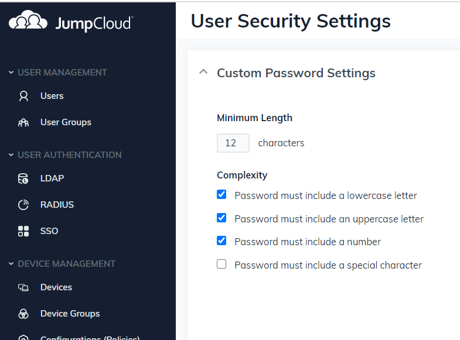
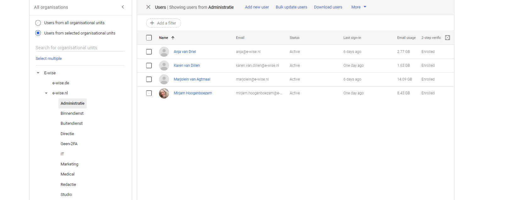
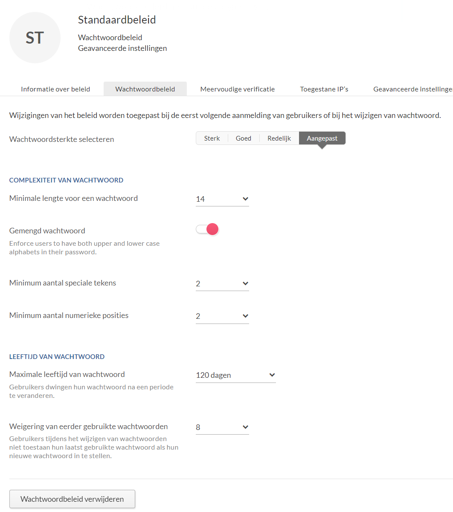
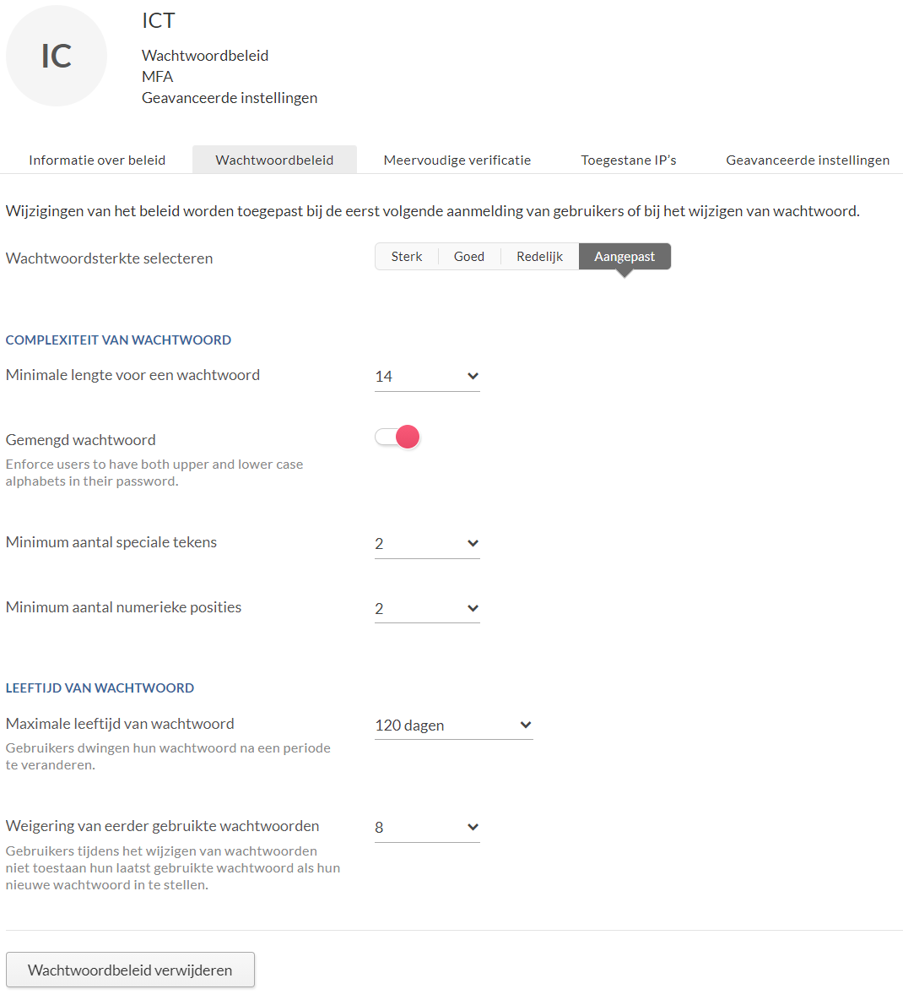
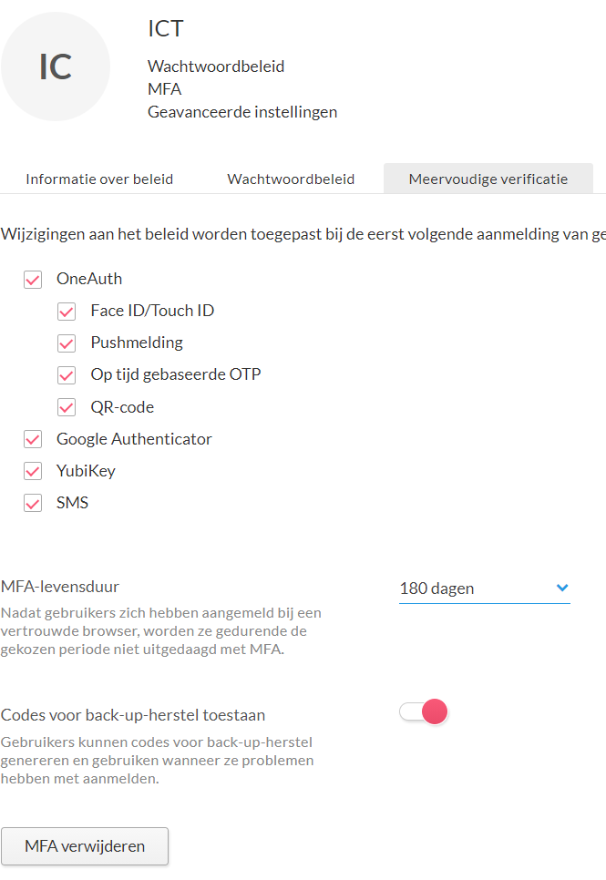
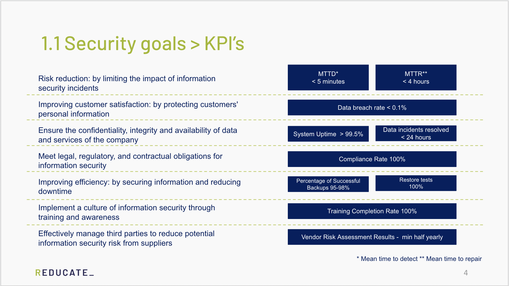
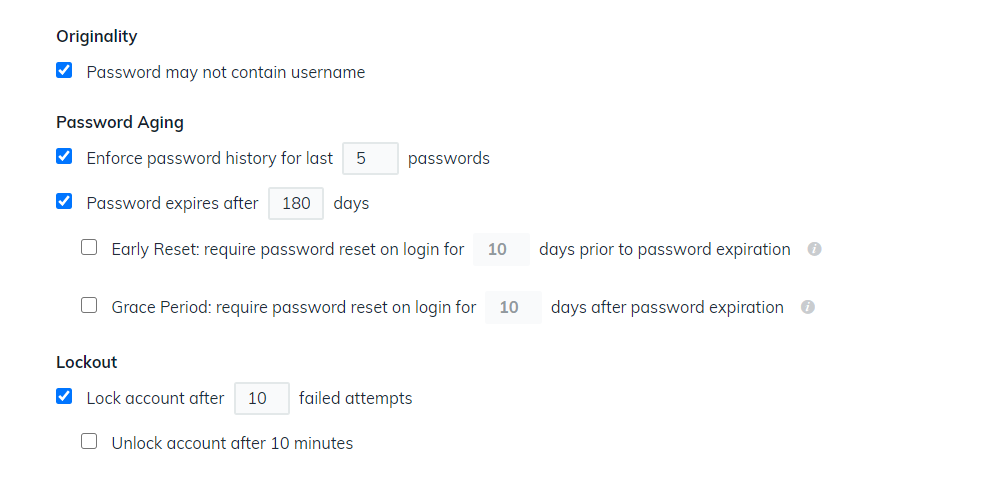
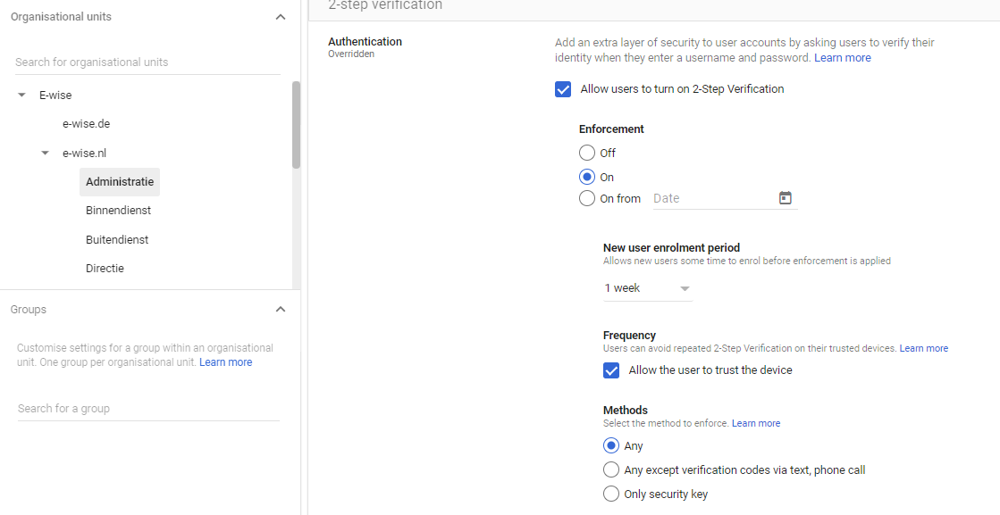
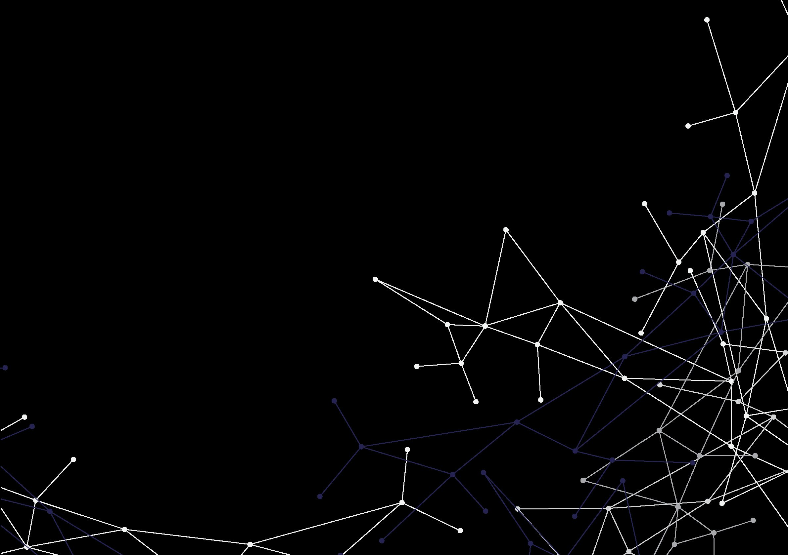

## File: Evidence controls are applied/Key holders server room _ Studios (Internal).pdf


## Page 1
Version:
1.2
Last modified:
22-10-2024
Classification
Internal
Location details
(V1)
p
Tigran Khatchadrijan
Studios, Janssoniuslaan 38 1st floor
Brigitte Schipper


## Page 2
Version:
Date:
Changes made by:
Document changes:
V1.0
20-12-2023
Johan Assen
Document created
V1.1
21-02-2024
Johan Assen
Added new studio keyholders
V1.2
22-10-2024
Johan Assen
Replaced studio keyholders


---

## File: Evidence controls are applied/Reducate - Disposal of devices [Confidential].docx

ISO 27001 Annex A7.14 - Security of Equipment disposal

Purpose: Ensure securely disposing devices

Procedure:

Secure Storage:

All decommissioned equipment is stored in a securely locked room designated for this purpose.

Access to this room is restricted to authorized personnel only, as defined in the organization’s access control policy.

Group companies may transfer equipment to Reducate for disposing

Management of Spare Parts:

Decommissioned equipment stored in the secure room may be used for spare parts.

End-of-Life Process:

When equipment reaches its end of life and is no longer suitable for use, including as a source of spare parts, it is designated for disposal.

Prior to disposal, all storage media are removed from the equipment.

All storage media are physically destroyed.

Equipment and destroyed storage media may be removed by specialised recycling companies.

Responsibilities:

IT staff are responsible for ensuring the secure storage and handling of decommissioned equipment.


---

## File: Evidence controls are applied/2.4.7 Template checklist indienst.PNG.pdf


## Page 1


**Image 1 OCR:**
```
v Template (kopiéren)

 

oO

Status ©

 

o

      
  
   

Welkomstkaart versturen

Laptop regelen en installeren

   

   

Datum @__ Creatie logboek

Bestanden

E-mail

Tel

 

 

(optioneel) vervoer regelen - NS kaart / auto

 

Inwerkschema & planning maken

& sep. 21, 2022 |

 

 

 

Office account aanmaken

 

Aanmelden voor de verschillende systemen

 

 

 

Welkomstpakket klaarzetten

 

Sleutel en tag klar leggen met overdracht document

 

 

sep. 21,2022

 

 

 

Uitleg eerste werkdag verzorgen

‘pl SiBlolo|olo |e

wit?

 

 

Bruikleenovereenkomst tekenén

sep.21,2022

 

 

Profielfoto laten maken

mrt.2

 

 

(Optioneel) Visitekaartje regelen

sep. 21,2022

 

 

Toovoegen aan Vetjaardagstalender(s)

mit.

 

 

“Inwetien op de helpdesk

sep. 21,2022

 

 

~ inplannen gesprek terugblik op week 1 voor téamleider

 

OJOJOJO/OJO/O|O;O;O,O/oO;o;o0;o

Inplannen proeftijd gesprek bij de teamleider

 

D/O] D| BD) © PS

DOO O| PD GQ O Pp Cig O|o

sep. 21,2022

 

sep. 21,2022

 

 

 

+ Voeg Item toe

Pe POF er er erewr

@
£

**Image Description:**
The image shows a checklist or task management table in Dutch related to onboarding or welcoming a new employee. 

The table includes columns labeled:
- Item (listing various onboarding tasks)
- Persoon (person responsible or assigned)
- Status 
- Datum (date)
- Creatie logboek (creation log with dates and profile pictures)
- Bestanden (files)
- E-mail
- Telefoon

Some items listed under "Item" are:
- Welkomstkaart versturen (Send welcome card)
- Aanmelden & dossier compleet in NMBR's (Register & complete dossier in NMBR's)
- Laptop regelen en installeren (Arrange and install laptop)
- (Optioneel) vervoer regelen - NS kaart / auto (Optional: arrange transport - train card / car)
- Inwerkschema & planning maken (Make onboarding schedule & planning)
- Office account aanmaken (Create office account)
- Aanmelden voor de verschillende systemen (Register for the various systems)
- Welkomstpakket klaarzetten (Prepare welcome package)
- Sleutel en tag klaar leggen met overdracht document (Prepare key and tag with transfer document)
- Uitleg eerste werkdag verzorgen (Provide explanation for the first workday)
- Bruikleenovereenkomst tekenen (Sign loan agreement)
- Profiel foto laten maken (Get profile photo taken)
- (Optioneel) Visitekaartje regelen (Optional: arrange business card)
- Toevoegen aan verjaardagskalender(s) (Add to birthday calendar
```


---

## File: Evidence controls are applied/2.4.8 Template checklist uitdienst.PNG.pdf


## Page 1


**Image 1 OCR:**
```
\ Template

Oo item
oO Inleveren sleutel en tag

@ Afmelden Office 7

fa ‘Afineiden verscifllen@Syauven

OG ‘Computer deinstalleren -

) =. Afmelden bijyMBR's

 

+ Voeg Item toe

**Image Description:**
This image shows a checklist table with the title "Template." The table contains columns labeled "Item," "Persoon," "Status," "Datum," and "Creatie logboek." Each row represents a task related to deregistration or uninstallation, presumably part of an offboarding or IT process. 

The visible tasks in the "Item" column are:
1. Inleveren sleutel en tag (Return key and tag)
2. Afmelden Office (Sign out of Office)
3. Afmelden verschillende systemen (Sign out of various systems)
4. Computer deinstalleren (Uninstall computer)
5. Afmelden bij NMBR's (Sign out from NMBR's)

The "Persoon" (Person) and "Status" columns contain icons or indicators which are blurred or greyed out. The "Datum" (Date) column is redacted, and the "Creatie logboek" (Creation logbook) column shows a repeated person's photo and "mrt. 2," likely indicating a creation date or log reference.

At the bottom, there is an option to add a new item with "+ Voeg item toe" (Add item). The table appears to be part of a workflow or project management tool, given the layout and icons.
```


---

## File: Evidence controls are applied/ELEARN4_Restoring_Test_(staging).pdf


## Page 1
Restoring Test (staging)
1
Restoring Test (staging)
Created
Status
Complete 🙌
Priority
P4
Engineers
S
Seiichi Arai S
Stephan
Label
Milestone
Production
Overview
Test it on staging environment. (need downtime)
TODOs
 
Database (Aurora)
Storage (EFS)
 
 
EFS and Aurora Restoring Test
 
 
Wrap Up
Approaches
@January 5, 2024 1:57 PM
Restoring operation
Share Test confirmation
Write document
snapshot exporting to S3


## Page 2
Restoring Test (staging)
2
1. Restoring new Instance from snapshot and switch connection
EFS and Aurora Restoring Test
2. Export mysqldump  data from snapshot and import existing instance
 


---

## File: Evidence controls are applied/Matrix rechten Zoho (Internal).pdf


## Page 1
Version:
1.0
Last modified:
17-04-2023
Classification:
Internal
Groep
Zoho CRM *
Redactie
Nee
Finance
Ja
Inside Sales/Binnendienst
Ja
Sales Leraren en Sales Overig
Ja
Marketing
Ja
IT
Ja
* Zoho CRM "ja" betekent ook edit/create rechten o


## Page 2
Bijzonderheden CRM
Zoho Clicq
nvt
Ja
Bewerkrechten op abonnementen, contracten, mutaties, facturatie. 
Mogen ook producten bewerken.  Organisaties/contacten/facturen zijn 
alleen indirect te verwijderen via controle script. Export rechten. 
Geen toegang tot crm campaigns. 
Ja
Beperkte bewerkrechten op abonnementen, contracten (opzegging 
gerelateerde velden). Leesrechten op facturen/mutaties/crm 
campaigns. Geen exportrechten op contacten/organisaties.
Ja
Alleen leesrechten op 
abonnementen/contracten/mutaties/producten/crm campaigns. 
Managers hebben ook bewerkrechten op contracten.
Organisaties/contacten alleen te verwijderen via controle script. 
Toegang tot rapportages. Export rechten op 
contacten/organisaties/contracten/abonnementen/leads/opportunities
.
Ja
Volledige toegang tot CRM Campaigns. 
Importrechten op Organisaties/Contacten/Leads. 
Export rechten.
Alleen leesrechten op abonnementen/contracten/mutaties/producten. Ja
Geen aparte afdeling in CRM maar Beheerdersrol.
Beheerder heeft volledige toegang. 
Stagaires hebben geen toegang tot CRM.
Ja
op de basisgegevens van Organisaties, Contactpersonen, Vergaderingen, Oproepen, Take


## Page 3
Zoho Creator apps
Zoho Campaigns
Zoho Projects
Zoho Analytics
Geen
Nee
Ja, specifieke projecten
KPI dashboards
Finance tools, 
abonnementen batch 
import
Nee
Nee
KPI dashboards. 
Rechten op sommige 
rapportages/automatis
che mail van sommige 
rapportages
Bellijsten/Campaigns
Nee
Nee
KPI dashboards incl. 
afdelings dashboards
Bellijsten
Nee
Nee
KPI dashboards incl. 
afdelings dashboards
Bellijsten/Campaigns
Ja
Ja (marketing)
KPI dashboards, 
mensen die met 
statistieken bezig zijn 
volledige rechten
Dev tools  (+afhankelijk van 
gebruiker)
Ja
Ja (IT)
KPI dashboards, 
mensen die met 
statistieken bezig zijn 
volledige rechten
en, Contact momenten, Leads, Opportunities, Notities, Bijlages.  Wijzigingen worden bijgehouden in logs.


## Page 4
Zoho Desk
Opmerkingen
Ja, Redactie desk
Ja, Finance desk, EME 
en Klant Support NL
Ja, Klant Support NL en 
Finance desk. 
Sommigen 
Bijeenkomsten desk
Alleen leesrechten op 
Klant Support NL en 
Finance desk *
Medewerkers die ook/voorheen 
binnendienst taken uitvoeren of 
uitgevoerd hebben kunnen nog  
binnendienst rechten hebben voor 
Desk/Creator en CRM
Ja, Klant Support NL en 
Finance desk, 
Bijeenkomsten desk
Ja, IT desk en alle 
overige desks


## Page 5


## Page 6


## Page 7
Version:
Date:
Changes made by:
V1.0
09-03-2023
Stephan Csorba


## Page 8
Document changes:
Document uploaded to ISMS


## Page 9
Version:
1.0
Last modified:
26-09-2023
Classification:
Internal
Employee
Changes
Lizzy
Beheerder (admin
Redactie
Medewerkers adm
Sales overig
CRM profiel, recht
Lars Gadellaa
Zoho Analytics be


## Page 10
Date
4-4-2023
17-4-2023
17-4-2023
26-09-2023


---

## File: Evidence controls are applied/Managment Review Team Meeting E-WISE 2025 [Restricted].docx.pdf


## Page 1
MANAGEMENT REVIEW TEAM MEETING 
Version: 1.0 Classification: Confidential  
 
 
E-WISE B.V. 
 
MANAGEMENT REVIEW TEAM MEETING 
 
Meeting Date and Time:  ​ 17 February 2025  
Meeting Location: ​ ​
Janssoniuslaan 38, 3528 AJ Utrecht, Nilufer’s office 
Dial in Details:​
​
As per calendar invite 
 
  Page 1 of 16 
 


**Image 1 OCR:**
```
REDUCATE-

**Image Description:**
The image shows the word "REDUCATE_" with the letter "R" in green and the rest of the letters in dark blue. The word ends with an underscore. The text is displayed on a white background.
```


## Page 2
MANAGEMENT REVIEW TEAM MEETING 
Version: 1.0 Classification: Confidential  
 
ATTENDEES: 
 
Name 
Title / Role / Representing 
Accepted? (Y/N) 
Nilufer Akpinar 
Managing director 
Y 
Ellen Smit 
Improvement Projects 
Y 
Marjolein van Agtmaal 
Finance Manager 
Y 
Tigran Khatchadrijan 
System Administrator 
Y 
Johan Assen 
Projectmanager / ISMS Responsible 
Y 
 
 
 
 
 
 
 
 
 
 
 
 
 
 
 
 
  Page 2 of 16 
 


**Image 1 OCR:**
```
REDUCATE-

**Image Description:**
The image shows the word "REDUCATE_" in capital letters on a white background. The letter "R" is in a green color, while the rest of the letters "EDUCATE_" are in dark blue. There is also an underscore character at the end of the word.
```


## Page 3
MANAGEMENT REVIEW TEAM MEETING 
Version: 1.0 Classification: Confidential  
 
 
Contents 
 
ATTENDEES:​
2 
NEW AGENDA ITEMS​
4 
EXITING AGENDA ITEMS​
4 
AGENDA​
5 
INFORMATION SECURITY OBJECTIVES MEASURES​
7 
DOCUMENTS RELEVANT TO MEETING​
8 
 
 
 
  Page 3 of 16 
 


**Image 1 OCR:**
```
REDUCATE-

**Image Description:**
This image displays the word "REDUCATE_" in uppercase letters on a white background. The first letter "R" is in green, while the rest of the letters and the underscore are in dark blue. The underscore at the end suggests something is incomplete or waiting to be filled in.
```


## Page 4
MANAGEMENT REVIEW TEAM MEETING 
Version: 1.0 Classification: Confidential  
 
NEW AGENDA ITEMS  
●​ Discuss risk assessments and improvements for 2025 (if there are any) 
●​ Discuss any other security improvements (after internal audit) 
 
EXISTING AGENDA ITEMS 
●​ Audit Results from 2024 have been addressed and solved during the year. See agenda point 5 from management review 
2024. There is one remaining point concerning A. 5.15. 
 
 
 
  Page 4 of 16 
 


**Image 1 OCR:**
```
REDUCATE-

**Image Description:**
The image contains the word "REDUCATE" displayed in uppercase letters. The letter "R" is colored green, while the rest of the letters are dark blue or black. The word ends with an underscore (_) symbol. The background is white.
```


## Page 5
MANAGEMENT REVIEW TEAM MEETING 
Version: 1.0 Classification: Confidential  
 
AGENDA 
 
Agenda 
Number 
Agenda Item 
Notes / Minutes 
1 
Actions from previous meeting 
1.​ An improvement has been recorded for internal printers in 2023. This 
is still in progress in 2024.​
​
This has been implemented  (Task) 
 
2.​ As of 1 December 2023 we have a centralised password​
 manager “Zoho Vault” implemented. ​
This has been implemented (Task)  
3.​ We are looking into the possibility of max duration of sharing 
documents outside E-WISE (Google drive) in 2024.​
Unfortunately this is not possible technically (Task). In the monthly 
checklist by Tigran there is a check to monitor if there is any user that 
shares a large amount of documents.  
  Page 5 of 16 
 


**Image 1 OCR:**
```
REDUCATE-

**Image Description:**
The image contains the word "REDUCATE_" with the letter "R" in green and the rest of the letters in dark blue. The word appears to be a combination or play on the words "Reduce" and "Educate," ending with an underscore. The design is simple with a clean, modern font on a white background.
```


## Page 6
MANAGEMENT REVIEW TEAM MEETING 
Version: 1.0 Classification: Confidential  
 
4.​ We are looking into the possibility to store raw recordings to a cloud 
environment 2024.​
This has been implemented(Task) 
5.​ We have end-point security. We look into the possibility / comparing 
of adding Crowstrike in 2024.​
We decided not to pursue this at the moment since we already have 
endpoint security in ManageEngine and Microsoft Defender. (Task) 
6.​ Simulates a phishing email in 2024. ​
First phishing email has been sent (Task), we are evaluating this 
(Task)  and will plan a followup. (Task) 
7.​ Security training updates in 2024.​
The Security training has been updated with a topic on AI(Task). We 
will send this in Q1 to staff. 
8.​ Restore tests in 2024.​
Restore tests have been successfully done (Task) 
  Page 6 of 16 
 


**Image 1 OCR:**
```
REDUCATE-

**Image Description:**
The image shows the word "REDUCATE_" with the first letter "R" in green and the rest of the letters in dark blue. The underscore at the end suggests it might be a prompt or an interactive element related to the word "REDUCATE."
```


## Page 7
MANAGEMENT REVIEW TEAM MEETING 
Version: 1.0 Classification: Confidential  
 
9.​ Communication is key in our organisation. We communicate 
information security related topics in our 2-monthly “krokettenlunch”​
​
We will continue this in 2025 
 
2 
Changes in external and internal issues 
that are relevant to the information 
security management system 
We have centralised the task management and documentation within the 
Reducate organisation.​
​
The co-tennant is moving out of the building on 31-3-2025 
3 
Nonconformities and corrective actions 
See Incident and CAPA log 
​
3 small size incidents with a total of 46 affected records: 
-​
Email adresses of small group of students were visible between 
these students (Task) 
-​
Student information of small group were visible to the wrong 
organisation 
-​
Wrong lms organisation connected to lms manager  
 
Currently there is a 4th in review with 11 affected records 
-​
Groupmanager linked to the wrong department in E-WISE Totaal 
Plus(In progress) 
4 
Monitoring and measurement results 
See table at the end of the document 
  Page 7 of 16 
 


**Image 1 OCR:**
```
REDUCATE-

**Image Description:**
The image shows the word "REDUCATE_" written in uppercase letters. The letter "R" is in green, while the rest of the letters and the underscore at the end are in navy blue. The background is white. The underscore at the end gives the impression of a text cursor, suggesting a word being typed or an incomplete phrase.
```


## Page 8
MANAGEMENT REVIEW TEAM MEETING 
Version: 1.0 Classification: Confidential  
 
5 
Audit Results 
Afwijking beoordeling, norm vaststellen, 
oorzaak van de afwijking, vaststellen of 
dat er gelijksoortige afwijkingen zich voor 
kunnen doen.  
External Audit 2024​
​
O-2024-02: Some documents have been written in a very general sense 
and still have traces of the original instructions.​
We fixed the specific findings and rewrite chapters of the policy when we 
update these for another reason. (Task)​
 
O-2024-01 - Stakeholder analysis - co-tennants​
We added the co-tennants in the stakeholder analysis. No associated risks 
(Task). 
 
O-2024-03: Segregation of duties is determined based on Zoho rights 
and financial system rights. 5.3 Segregation of duties has been tied to 
a risk of employees not knowing​
Risk mapping has been redone​
​
NC-B-2024-01: Operational planning and control 
We scheduled regular meetings with the ISWG of other group companies 
and restructured the ISMS and task system for better overview and 
integration.​
​
O-2024-04: the organization may need a formal DPO due to the large 
scale of clients on the platform for which the organization monitors 
course work and results.​
The management of E-WISE and Blueprint Learning investigated this topic 
and it did not meet the requirements of the GDPR authority. An internal DPO 
is deemed sufficient. Risk 3.4 is raised for this and accepted.​
​
O-2024-05: Scope documentation should be appropriately updated to 
  Page 8 of 16 
 


**Image 1 OCR:**
```
REDUCATE-

**Image Description:**
The image shows the word "REDUCATE_" written in uppercase letters. The letter "R" is in a green color, while the other letters are in dark blue or black. There is an underscore character "_" at the end of the word. The background is white.
```


## Page 9
MANAGEMENT REVIEW TEAM MEETING 
Version: 1.0 Classification: Confidential  
 
accurately include locations and activities in each as well as any 
dependencies. 
We have rewritten the Scope documentation to include E-WISE, Blueprint 
Learning and Thar. (Task)​
​
O-2024-06: Policy documentation at Thar is not shared in the same 
way and, despite the document being attached to the security training, 
auditees couldn’t find it again during the audit. 
Currently this document is shared via the security training and available in 
the regular locations for staff information (Task) 
 
E-WISE Internal Audit 
 
9.2: Overweeg het “How to conduct an internal audit (internal)” 
document te evalueren, zodat het eenduidig stelt dat ieder jaar het 
gehele ISMS wordt geaudit. 
We will redesign our Internal Audit approach (Task) 
 
6.1.3D: Overweeg te kijken naar de reden voor implementatie en wees 
specifieker in wat de die reden dan inhoud​
We will review the descriptions for Vulnerability, Result in the risk register 
(Task) 
 
 
A.5.29: Overweeg om het gebruik en scenario’s van het 
continuïteitsplan te testen. 
Added to Notion (Task) 
 
 
  Page 9 of 16 
 


**Image 1 OCR:**
```
REDUCATE-

**Image Description:**
The image shows the word "REDUCATE" in capital letters, with the letter "R" in green and the rest of the letters in dark blue. There is an underscore "_" after the last letter "E." The background is white.
```


## Page 10
MANAGEMENT REVIEW TEAM MEETING 
Version: 1.0 Classification: Confidential  
 
A.5.28: Er is nog geen bewijsmateriaal beschikbaar in de 
incidentenprocedure. 
CAPA made and improvement implemented (CAPA / Task)​
 
6 
Fulfilment of information security 
objectives 
Recorded in the table at the end of the document. 
7 
Feedback from interested parties 
We have a yearly Finance / IT audit carried out by BDO. These results and 
improvements are being reported in Notion when the report has been 
completed. 
8 
Risk Assessment Results and Status of 
Risk Treatment Plan 
New Risks​
No Single Signon for the central management password vault can lead to a 
data breach.Risk #1.2.8.11​
 
No technical check for duplicate organization numbers in ZOHO can lead to 
a data leak. Risk #1.2.8.12​
 
By not having a formal DPO registered at the GDPR authority, E-WISE, 
Thar and Blueprint Learning risk not complying with GDRP.Risk #3.4 
 
We discussed to add a Risk regarding long term failure of a major cloud 
provider (Risk 2.8), The ISSC sees this risk as having low probability and 
thus accepts it. Risk #2.8 
 
 
  Page 10 of 16 
 


**Image 1 OCR:**
```
REDUCATE-

**Image Description:**
The image shows the word "REDUCATE_" written in uppercase letters. The letter "R" is in green, while the rest of the letters and the underscore are in dark blue. The background is white.
```


## Page 11
MANAGEMENT REVIEW TEAM MEETING 
Version: 1.0 Classification: Confidential  
 
9 
Opportunities for Continual Improvement 
 
●​ Policy for laptop updates has been improved (Task) 
●​ Blocking deepseek due to privacy concerns (Task) 
●​ Improving Spam filters in the Google environment (Task)​
 
●​ We still have a task to implement 2-FA on our E-LEARNING 
platforms, what to do with this? (Task)​
​
The ISSC decided to postpone this topic because both risks and 
customer demand are limited.​
In addition: The E-WISE business is hesitant to apply this function 
because our business demands easy access to e-learning. ​
 
●​ Investigate a Reducate wide security training (Task) 
 
 
10 
Any other business 
GDPR meetings have been conducted 
 
 
 
 
INFORMATION SECURITY OBJECTIVES MEASURES 
 
  Page 11 of 16 
 


**Image 1 OCR:**
```
REDUCATE-

**Image Description:**
The image shows the word "REDUCATE_" with the letter "R" in green and the rest of the letters in dark blue, followed by an underscore. The overall style is clean and modern, with a white background.
```


## Page 12
MANAGEMENT REVIEW TEAM MEETING 
Version: 1.0 Classification: Confidential  
 
It is good practice to record the objectives of the ISMS and to review the measures in the management review team meeting. The objectives 
here are taken from the Information Security Management System document. If you have changed them there, then change them here. This 
needs to be your objectives as recorded. 
 
Objective 
Planned KPI’s 
Achieved 
Measurement  
Risk reduction: by limiting the impact 
of information security incidents 
MTTD ​
< 5 minutes​
MTTR  
< 4 hours 
MTTD  
< 5 minutes 
MTTR  
3​
 
The process of internal audit, training for 
employees and continual improvement are 
operating effectively, monitors and measures 
are being tracked and within tolerance. 
Improving customer satisfaction: by 
protecting 
customers' 
personal 
information 
Data breach rate ​
< 0.1% 
Data breach rate  
0.1%​
 
The ISMS continues to improve customer 
satisfaction. 
We 
have 
added 
security 
improvements.  
Ensure the confidentiality, integrity 
and availability of data and services of 
the company 
System Uptime ​
> 99.5% 
System Uptime  
99,9% 
The 
current 
measurements, 
backups, 
monitoring and logging are being in place and 
performing well for all information systems.  
  Page 12 of 16 
 


**Image 1 OCR:**
```
REDUCATE-

**Image Description:**
The image shows the word "REDUCATE_" with the letter "R" in green and the rest of the letters and the underscore in dark blue. The background is white. The word appears to be styled in a modern, clean font. The underscore at the end suggests a prompt or something unfinished.
```


## Page 13
MANAGEMENT REVIEW TEAM MEETING 
Version: 1.0 Classification: Confidential  
 
Data incidents 
resolved ​
< 24 hours  
 
 
Data incidents 
resolved ​
48 hours 
 
Meet legal, regulatory, and contractual 
obligations for information security 
Compliance Rate 
100% 
Compliance Rate 
100% 
 
 
The ISMS continues to meet its legal and 
regulatory obligations. There are no new 
contractual requirements recorded. Training is 
on track and well accepted for all employees. 
There 
is 
an 
onboarding 
in 
place 
for 
information security. 
Improving 
efficiency: 
by 
securing 
information and reducing downtime 
Percentage of 
Successful Backups ​
95-98%​
Restore tests 
100% 
Percentage of 
Successful Backups ​
100%​
Restore tests 
100% 
The ISMS continues to secure information and 
reduce downtime. Backups are on track and a 
restore test has been successfully done 
  Page 13 of 16 
 


**Image 1 OCR:**
```
REDUCATE-

**Image Description:**
The image contains the text "REDUCATE_" displayed in a simple, modern font. The letter "R" is colored in green, while the rest of the letters and the underscore are in dark blue or black. The background is plain white. This text could be part of a logo or brand name.
```


## Page 14
MANAGEMENT REVIEW TEAM MEETING 
Version: 1.0 Classification: Confidential  
 
(A5.29 Restore tests). Requirements will be 
updated in 2025 for restore tests if applicable. 
Implement a culture of information 
security 
through 
training 
and 
awareness 
Training Completion ​
​
100%% 
Training Completion ​
​
100% 
The results of the training plan were noted as 
on track with all employee’s current on 
planned 
and 
taken 
information 
security 
training. Communication was sent to all staff. 
An updated training is being planned for 2025 
Information 
security 
goals 
are 
being 
communicated and added to the training. The 
information security policy is shared with all 
employees. 
Effectively manage third parties to 
reduce potential information security 
risk from suppliers 
Vendor Risk 
Assessment Results​
All key suppliers 
Vendor Risk 
Assessment 
Results​
All key suppliers are 
Third 
party 
management 
is 
operating 
effectively, and the third-party register is up to 
date. All reviews are recorded as being on 
  Page 14 of 16 
 


**Image 1 OCR:**
```
REDUCATE-

**Image Description:**
The image contains the word "REDUCATE" in capital letters with an underscore at the end. The letter "R" is colored green, while the rest of the letters are dark blue. The background is white.
```


## Page 15
MANAGEMENT REVIEW TEAM MEETING 
Version: 1.0 Classification: Confidential  
 
audited, in 2025 
reports will be added 
track any nonconformities are added to Notion 
to improve.  
 
 
  Page 15 of 16 
 


**Image 1 OCR:**
```
REDUCATE-

**Image Description:**
The image contains the word "REDUCATE_" written in uppercase letters. The letter "R" is in green color, while the rest of the letters "EDUCATE_" are in dark blue. The background is white. The underscore at the end suggests the possibility of continuation or input.
```


## Page 16
MANAGEMENT REVIEW TEAM MEETING 
Version: 1.0 Classification: Confidential  
 
DOCUMENTS RELEVANT TO MEETING 
List documents that are provided as part of the meeting.​
Policy 
Information Security Policy - [Internal] 
 
External Audit 
External Audit report 
External Audit report - scope expansion 
 
Internal audit 
E-WISE Interne Audit 2024 
 
Risk analyses 
Risk register 
 
Other information​
GDPR meetings  
Business Continuity Plan [Confidential] 
Communication plan [Confidential] 
 
  Page 16 of 16 
 


**Image 1 OCR:**
```
REDUCATE-

**Image Description:**
The image shows the word "REDUCATE_" with the letter "R" in green and the rest of the letters in dark blue. There is an underscore after the final "E," suggesting a space to add more text or indicating a prompt for continuation. The background is white.
```


---

## File: Evidence controls are applied/Kopie van BS02 E-Wise Wachtwoordbeleid [Internal].pdf


## Page 1
E-Wise Wachtwoordbeleid
Wachtwoordbeleid Jumpcloud (algemeen)
2
Wachtwoordbeleid Google
3
Wachtwoordbeleid  Zoho
4
Welkomstbrief nieuwe gebruikers
7
Eenmalige inloggegevens
7
Windows
7
Websites van E-WISE
7


## Page 2
Wachtwoordbeleid Jumpcloud (algemeen)
Wachtwoord bij Jump Cloud aanpassen word gelijke bij G-suite google ook aangepast SSO.
●
12 tekens Minimaal.
●
Hoofdleter
●
Cijfer
●
5x Wachtwoordhistorie
●
Lockout na 10 ongeldige aanmelding.
●
bij inloggen User ID: invoeren


**Image 1 OCR:**
```
COO elo User Security Settings

Custom Password Settings
ead

eect Minimum Length

12 characters

ry Complexity

Password must include a lowercase letter
YN

Password must include an uppercase letter
sso

Password must include a number
© Password must include a special character

Dre

Deeekct ry

**Image Description:**
The image shows a user interface screen from JumpCloud for "User Security Settings." It focuses on the section "Custom Password Settings," where the user is setting password requirements.

Details include:
- Minimum Length: 12 characters
- Complexity requirements with checkboxes:
  - Password must include a lowercase letter (checked)
  - Password must include an uppercase letter (checked)
  - Password must include a number (checked)
  - Password must include a special character (unchecked)

The left sidebar shows navigation options under categories such as:
- User Management (Users, User Groups)
- User Authentication (LDAP, RADIUS, SSO)
- Device Management (Devices, Device Groups, Configurations/Policies)
```


**Image 2 OCR:**
```
Originality

Password may not contain username

Password Aging

Enforce password history for last 5 passwords
Password expires after 180 days

©) Early Reset: require password reset on login for 10

©) Grace Period: require password reset on login for 10

Lockout

Lock account after 10 — failed attempts

© Unlock account after 10 minutes

days prior to password expiration

days after password expiration

**Image Description:**
The image shows a set of password policy settings related to originality, password aging, and lockout rules:

- Originality:
  - "Password may not contain username" is checked.

- Password Aging:
  - "Enforce password history for last 5 passwords" is checked.
  - "Password expires after 180 days" is checked.
  - "Early Reset: require password reset on login for 10 days prior to password expiration" is unchecked.
  - "Grace Period: require password reset on login for 10 days after password expiration" is unchecked.

- Lockout:
  - "Lock account after 10 failed attempts" is checked.
  - "Unlock account after 10 minutes" is unchecked.
```


## Page 3
Wachtwoordbeleid Google
●
Wachtwoord wordt overgenomen vanuit Jumpcloud.
●
Iedereen in e-wise heeft twee factor authentication.
○
○


**Image 1 OCR:**
```
Showing settings for users in IT

 

Security Settings
2-step verification
Organisational units A
Authentication
overaden
al units
Administratie
Binnendienst

Buitendienst
Directie
Geen-2FA,

IT

Marketing

Groups A

 
 

nal
Learn more

 

‘Add an extra layer of security to user accounts by asking users to verify their
identity when they enter a usemame and password. Lea more

Allow users to turn on 2-Step Verification

‘New user enrolment period
‘Allows new users some time to enrol before enforcement is applied

1 day +

Frequency

Users can avoid repeated 2Step Verification on their trusted devices. Learn more

Allow the user to trust the device

Methods

Select the method to enforce, Lean more
@ay

CO Any except verification codes via text, phone call
O only security key

**Image Description:**
The image shows a "Security Settings" interface for managing 2-step verification settings for users in the "IT" organizational unit. 

Key details visible are:

- Organisational units listed on the left include: Administratie, Binnendienst, Buitendienst, Directie, Geen-2FA, IT (selected), Marketing.
- Under "2-step verification":
  - Authentication is overridden.
  - There's a checkbox to allow users to turn on 2-Step Verification, which is checked.
  - Enforcement options with "On" selected (other options are Off or On from a specified date).
  - New user enrolment period set to 1 day.
  - Frequency section with the option "Allow the user to trust the device" checked.
  - Methods to enforce 2-Step Verification, with "Any" selected. Other method options are:
    - Any except verification codes via text, phone call
    - Only security key.

This interface is used to configure how 2-step verification is applied to users within the IT organizational unit in the system.
```


**Image 2 OCR:**
```
Organisational units

    

janisational units

ewise.de

+ ewisenl
Administratie
Binnendienst
Buitendienst

Directie

Groups

ustomi

 

 

step verilication

Authentication
‘Overtidden

 

Learn more

‘Add an extra layer of security to user accounts by asking users to verify their
identity when they enter a usemame and password. Lea more

Allow users to turn on 2-Step Verification

O onfrom Date 6
New user enrolment period
Allows new users some time to enrol before enforcement is applied
‘week ¥
Frequency

Users can avoid repeated 2Step Verification on their trusted devices. Learn more

Allow the user to trust the device

Methods

Select the method to enforce, Lean more
@ay

CO Any except verification codes via text, phone call
O only security key

**Image Description:**
This image shows a settings interface for managing 2-step verification (2-step authentication) in an organizational context, likely from an admin console for user account security.

On the left side, there is a navigation panel labeled "Organisational units," displaying a hierarchy with different units:
- E-wise
  - e-wise.de
  - e-wise.nl (expanded)
    - Administratie (selected)
    - Binnendienst
    - Buitendienst
    - Directie

There is also a "Groups" section below that allows customization of settings for a group within an organizational unit.

On the right side, there are 2-step verification configuration options including:

- A checkbox to allow users to turn on 2-Step Verification (checked).
- Enforcement options:
  - Off
  - On (selected)
  - On from [date]
- New user enrolment period dropdown, currently set to "1 week."
- Frequency section with a checkbox "Allow the user to trust the device" (checked).
- Methods section where you select the method to enforce:
  - Any (selected)
  - Any except verification codes via text, phone call
  - Only security key

The interface provides additional "Learn more" links for further information on some options. Overall, it is a configuration screen for setting and enforcing multi-factor authentication policies for users in a specific organizational unit.
```


## Page 4
○
○


**Image 1 OCR:**
```
All organisations

© Users from all organisational units

© Users from selected organisational units

Search for organisational units

Select muitiple

+ Ewise
ewise.de
+ ewisen!
Administratie
Binnendienst
Buitendienst
Directie

Geen2FA

Marketing
Medical
Redactie

Studio

X_ Users | Showing users from Administratie

 

+ Adda filter

‘Anja van Driel

Karen van Dillen

 

Marjolein van Agtmaal

@ werrortosen

 

‘Add new user Bulk update users

Email

anja@e-wisen!

karen.van.dillen@e-wise.nl

marjolein@ewise.ni

mmirjam.hoogenboezem@e-

status

Active

Active

Active

Active

Download users

More ¥

Last signin

6 days ago

One day ago

6 days ago

One day ago

Email usage

27768

1.6368

14.09 GB

8.4368

2arepveriic
Enrolled
Enrolled
Enrolled

Enrolled

**Image Description:**
This image shows a user management interface, likely from an organization's administrative tool or email management system. 

On the left side, there is a panel titled "All organisations" with options to filter users either from all organizational units or from selected organizational units. The selected option here is "Users from selected organisational units." Below that, there is a hierarchical list of organizational units under "E-wise," with subunits such as "e-wise.de" and "e-wise.nl." The "Administratie" unit under "e-wise.nl" is highlighted.

On the right side, a list of users from the "Administratie" unit is displayed. The table contains columns for:
- Name (with user icons or photos)
- Email
- Status (all are "Active")
- Last sign-in (ranging from "6 days ago" to "One day ago")
- Email usage (ranging from 1.63 GB to 14.09 GB)
- 2-step verification status (all users are "Enrolled")

There are also options at the top for adding a new user, bulk updating users, downloading users, and more actions.
```


**Image 2 OCR:**
```
All organisations

© Users from all organisational units

© Users from selected organisational units

Search for organisational units

Select muitiple

> Ewise
ewise.de
+ ewise.nl
Administratie
Binnendienst

Buitendienst

X__ Users | Showing users from IT

 

(+b Adda filter

‘Admin Back-up
Coen de Koning
Daan van Paassen
Dirk van der Zee
Edwin Eshuis
Hasker Brouwer

Iris Magnée

Misja Op de Cou!
Romain van Maanen
Tigran Khatchadrijan
Youri Koeman

Stephan Csorba

 

oo0oonudaooaoaooaoa

 

‘Add newuser Bulk update users

Email

admingewise.nl

coen de koning@e-wise ni

daange-wise.n!

ditk@e-wise.nl

edwin.eshuis@e-wise.n!

hasker brouwer@e-wise.n

iris magnee@=-wise nl

misja@e-wise.nl

romain.van.maanen@e-wis.

tigran khatchadrijan@e-wis.

your koeman@e-wise nl

stephan. csorba@ewise.nl

Download users

status

Active

Active

Active

Active

Active

Active

Active

Active

Active

Active

Active

Active

More ¥

Last signin

A months ago

Adays ago

2 days ago

S days ago

One week ago

2 days ago

2 days ago

6 days ago

2 days ago

One day ago

One week ago

6 days ago

 

Email usage

5.0868

3.0668

70768

5.4368

0.6668

5268

20768

3.1168

0.08 68

1.8668

0.0668

01168

2arepveriic
Enrolled
Enrolled
Enrolled
Enrolled
Enrolled
Enrolled
Enrolled
Enrolled
Enrolled
Enrolled
Enrolled

Enrolled

**Image Description:**
The image shows a user interface, likely from an admin panel or user management system for an organization. It displays a list of users filtered from the "IT" organizational unit under the domain "e-wise.nl." 

On the left side, there's a navigation panel where organizational units are listed, with "IT" selected under "e-wise.nl." There are options to view users from all organizational units or selected ones, and the option to search for organizational units.

The main section on the right lists users with columns for:
- Name (e.g., Admin Back-up, Coen de Koning, Dirk van der Zee, etc.)
- Email addresses associated with each user
- Status (all are "Active")
- Last sign-in time (e.g., "4 months ago," "4 days ago," "2 days ago")
- Email usage in GB
- 2-step verification status (all "Enrolled")

There are actionable options at the top: Add new user, Bulk update users, Download users, and a More drop-down menu. Some users have profile pictures or initials displayed next to their names.
```


## Page 5
Wachtwoordbeleid  Zoho
Wordt niet gebruikt, gebruikers melden met Google aan
Ingestelde settings voor alle gebruikers en apart IT met two factor authentication


**Image 1 OCR:**
```
Standaardbeleid

ST Wachtwoordbeleid
Geavanceerde instellingen

 

Informatie over beleid Wachtwoordbeleid Meervoudige verificatie Toegestane IP's Geavanceerde instellinge

 

Wiiz
Wachtwoordsterkte selecteren Sterk  Goed | Redelijk Es

COMPLEXITEIT VAN WACHTWOORD,

ingen van het beleid worden toegepast bij de eerst volgende aanmelding van gebruikers of bij het wijzigen van wachtwoord.

 

Minimale lengte voor een wachtwoord 14 v

Gemengd wachtwoord e@

Enforce users to have both upper and lower case
alphabets in their password.

Minimum aantal speciale tekens 2 v
Minimum aantal numerieke posities 2 v
LEEFTID VAN WACHTWOORD

Maximale leeftijd van wachtwoord 120 dagen v
Gebruikers dwingen hun wachtwoord na een periode

te veranderen.

Weigering van eerder gebruikte wachtwoorden 8 v

Gebruikers tijdens het wijzigen van wachtwoorden
niet toestaan hun laatst gebruikte wachtwoord als hun
nieuwe wachtwoord in te stellen.

Wachtwoordbeleid verwijderen

**Image Description:**
This image shows a settings page for configuring a password policy in Dutch ("Standaardbeleid" means "Standard policy"). The selected tab is "Wachtwoordbeleid" which means "Password policy".

Here are the key settings visible:

- Password strength options: Sterk (Strong), Goed (Good), Redelijk (Reasonable), Aangepast (Custom) with the Custom option selected.
- Password complexity:
  - Minimum password length: 14 characters.
  - Mixed case (upper and lower case alphabets) required: This is turned off.
  - Minimum number of special characters: 2.
  - Minimum number of numeric characters: 2.
- Password age settings:
  - Maximum password age: 120 days (users must change their password after this period).
- Password history:
  - Number of previously used passwords disallowed: 8 (users cannot reuse their last 8 passwords).

At the bottom, there is a button to remove the password policy ("Wachtwoordbeleid verwijderen" means "Remove password policy").
```


## Page 6


**Image 1 OCR:**
```
ICT

Ic Wachtwoordbeleid
MFA
Geavanceerde instellingen

Informatie over beleid Wachtwoordbeleid Meervoudige verificatie Toegestane IP's Geavanceerde instellingen

Wijzigingen van het beleid worden toegepast bij de eerst volgende aanmelding van gebruikers of bij het wijzigen van wachtwoord.

Wachtwoordsterkte selecteren Sterk  Goed | Redelijk Es

COMPLEXITEIT VAN WACHTWOORD,

Minimale lengte voor een wachtwoord 14 v

Gemengd wachtwoord e@

Enforce users to have both upper and lower case
alphabets in their password.

Minimum aantal speciale tekens 2 v

 

Minimum aantal numerieke pos 2 v
LEEFTID VAN WACHTWOORD

Maximale leeftijd van wachtwoord 120 dagen v
Gebruikers dwingen hun wachtwoord na een periode

te veranderen.

Weigering van eerder gebruikte wachtwoorden 8 v

 

Gebruikers tijdens het wijzigen van wachtwoorden
niet toestaan hun laatst gebruikte wachtwoord als hun
nieuwe wachtwoord in te stellen.

Wachtwoordbeleid verwij

**Image Description:**
This image shows a settings page for managing password policies in Dutch. The section is titled "Wachtwoordbeleid" (Password Policy) under "ICT."

Key settings include:

- Password strength selection with options: Sterk (Strong), Goed (Good), Redelijk (Reasonable), Aangepast (Custom), with "Aangepast" selected.
  
- Password complexity:
  - Minimum password length set to 14 characters.
  - Mixed case password enforcement toggle, which is currently off.
  - Minimum special characters required: 2.
  - Minimum numeric positions required: 2.
  
- Password age:
  - Maximum password age: 120 days (after which users must change their password).
  
- Password reuse policy:
  - Denial of previously used passwords up to 8 past passwords.

There is a button at the bottom labeled "Wachtwoordbeleid verwijderen" (Remove password policy). 

Tabs at the top indicate other sections like Information about policy, Multi-factor authentication, Allowed IPs, and Advanced settings.
```


## Page 7


**Image 1 OCR:**
```
ICT

Ic Wachtwoordbeleid
MFA
Geavanceerde instellingen

Informatie over beleid Wachtwoordbeleid Meervoudige verificatie

Wijzigingen aan het beleid worden toegepast bij de eerst volgende aanmelding van g¢

MV] OneAuth
{Y) Face ID/Touch ID
M Pushmelding
V Op tijd gebaseerde OTP
| QR-code
{¥| Google Authenticator
M YubiKey
lv) SMS

MFA-levensduur 180 dagen v

Nadat gebruikers zich hebben aangemeld bij een
vertrouwde browser, worden ze gedurende de
gekozen periode niet uitgedaagd met MFA.

Codes voor back-up-herstel toestaan e@

Gebruikers kunnen codes voor back-up-herstel
genereren en gebruiken wanneer ze problemen
hebben met aanmelden.

MFA verwijderen

**Image Description:**
This image shows a settings page for multi-factor authentication (MFA) under an ICT section titled "Wachtwoordbeleid" (Password Policy). The language is Dutch.

The main settings include various MFA verification methods, with checkboxes marked for:
- OneAuth, including options for:
  - Face ID/Touch ID
  - Push Notification
  - Time-based OTP (One-Time Password)
  - QR-code
- Google Authenticator
- YubiKey
- SMS

The "MFA-levensduur" (MFA lifetime) is set to 180 days, meaning after users log in with a trusted browser, they will not be required to authenticate with MFA again for 180 days.

There is an option to allow "Codes voor back-up-herstel toestaan" (codes for backup recovery), which is currently disabled.

At the bottom, there is a button labeled "MFA verwijderen" (Remove MFA).
```


## Page 8


**Image 1 OCR:**
```
ICT

Ic Wachtwoordbeleid
MFA
Geavanceerde instellingen

Informatie over beleid Wachtwoordbeleid Meervoudige verificatie

BEHEER VAN WEBSESSIES

Levensduur van sessies 15 dagen v

Gebruikers worden na de gekozen periode
automatisch afgemeld van hun account.

Time-out voor niet-actieve sessie Geen limiet v

Gebruikers worden automatisch afgemeld van hun
account, als ze gedurende de gekozen periode inactief
blijven.

Gelijktijdige sessies Geenlimiet v

Gebruikers krijgen alleen het gekozen aantal
gelijktijdige actieve sessies.

**Image Description:**
The image shows a settings page in Dutch related to ICT, specifically focusing on password policy, MFA (multi-factor authentication), and advanced settings.

The visible tab is titled "Meervoudige verificatie" (Multiple Verification).

Under the section "BEHEER VAN WEBSESSIES" (Management of Web Sessions), the following settings are visible:

1. "Levensduur van sessies" (Duration of sessions) with a selected value of "15 dagen" (15 days).
   - Description: Users are automatically logged out of their account after the chosen period.

2. "Time-out voor niet-actieve sessie" (Timeout for inactive session) with a selected value of "Geen limiet" (No limit).
   - Description: Users are automatically logged out if they remain inactive for the chosen period.

3. "Gelijktijdige sessies" (Simultaneous sessions) with a selected value of "Geen limiet" (No limit).
   - Description: Users get only the chosen number of simultaneous active sessions.

The page seems to allow configuration of session security and management settings for user accounts.
```


## Page 9
Welkomstbrief nieuwe gebruikers
Eenmalige inloggegevens
Gebruikersnaam Windows: rian.senden
Gebruikersnaam e-mail/websites: rian.senden@e-wise.nl
Tijdelijk wachtwoord: Welkom bij e-wise2020
Windows
Bij het inloggen in Windows wordt gevraagd om een nieuw wachtwoord. Deze mag je zelf kiezen
maar moet wel aan een aantal voorwaarden voldoen:
Om een voldoende sterk wachtwoord te krijgen zal de lengte minstens 12 tekens moeten zijn.
Om dit goed te kunnen onthouden raad ik aan om twee of meer simpel te onthouden woorden te gebruiken (bijv. “zomer
strand vakantie”, maar “zomer strand” heeft al voldoende lengte en is sterk genoeg).
Extra wachtwoordtips:
●
Naast spaties kun je bijv. ook underscores (_) tussen de woorden gebruiken (zomer_strand_vakantie)
●
Gebruik van Hoofdletters (Zomer Strand Vakantie)
●
Om het nog sterker te maken kun je een speciaal teken toevoegen (Zomer Strand_Vakantie!)
Elke 6 maanden zal je een melding krijgen om hem weer te wijzigen. Een vorig wachtwoord mag niet opnieuw
worden gebruikt. Het Windows wachtwoord is ook gekoppeld aan de mail. Het mail wachtwoord veranderd dus
automatisch mee maar de websites (nog) niet.
Websites van E-WISE
Je hebt een eenmalige login link in de mail gekregen van ons Single Sign-on system equbelogin.nl.
Ook hier moet je een nieuw wachtwoord instellen (mag overeenkomen met het Windows
wachtwoord). Hiermee kan je vervolgens inloggen op alle nascholingssites.


---

## File: Evidence controls are applied/Log retention (Internal).pdf


## Page 1
Version:
1.1
Last modified:
01-03-2023
Classification
Internal
System details
Duration for Log retention
Internal
Firewalls & Routers
No logging
Client to Site VPN / Remote access
3 days retention
External
Learn environments (AWS)
30 days retention
Marketing websites (Platform.sh)
y
g
p
g
3 months retention
ZOHO One CRM
60 days retention
Other systems
y
p
30 days retention


## Page 2
Version:
Date:
Changes made by:
Document changes:
V1.0
19-02-0203
Stephan Csorba
Document created
V1.1
01-03-2023
Stephan Csorba
Added version history


---

## File: Evidence controls are applied/A.5.25/#18- CAPA-form [Confidential] - possible confidential sales data leaked during offboarding of employee .docx.pdf


## Page 1
 
CAPA  Reference No.: 18 
Start Date:   26-4-2025 
Non Conformity / Improvement/ Preventive Action: 
An employee that was leaving involuntarily sent some confidential data to an external mail address 
Details 
An employee's contract was not renewed due to inadequate performance. After an interview was held, 
colleague saw that some documents on a shared drive were missing. Based on this,  the Operational Director 
of E-WISE started an investigation on june 5th of the mail behaviour of the employee by  Reducate system 
administrator.  
 
This employee sent some email messages containing information about customers to his own external email 
address. This involved names and business email addresses of these customers. This involved a total of 29 
emails  
In addition, there are indications that this person opened the company applications on a private laptop. This 
is against the Information Security Policy 
After this was discovered, E-WISE filed a lawsuit against this person to ensure the information would be 
destroyed. 
In the settlement agreement (VSO) the employee agrees that she does not hold any information anymore 
that belongs to the E-WISE business.​
​
 
 
Present Status 
 
 
Target: 
Target Date: 
Closed 
Have the personal information 
removed. 
25-6-2025 
CAPA Leader: Johan Assen 
 
Team Member:  All people that were involved in processing the issue 
1. Nilufer Akpinar 
2. Tigran Khatchadrijan 
3.  
4. 
5. 
Classification: Confidential​
1 


**Image 1 OCR:**
```
Tot slot wijzen wij u er nadrukkelijk op dat u met ondertekening van de vaststellingsovereenkomst
expliciet verklaart dat u geen enkel bedrifseigendom — waaronder, maar niet beperkt tot, digitale
bestanden, fysieke documenten, vertrouwelijke klantgegevens, interne rapportages en e-mails — meer
in uw bezit heeft, dan wel op enigerlei wijze heeft gekopieerd, opgeslagen of gedeeld met derden.

**Image Description:**
The image contains Dutch text that reads:

"Tot slot wijzen wij u er nadrukkelijk op dat u met ondertekening van de vaststellingsovereenkomst expliciet verklaart dat u geen enkel bedrijfseigendom — waaronder, maar niet beperkt tot, digitale bestanden, fysieke documenten, vertrouwelijke klantgegevens, interne rapportages en e-mails — meer in uw bezit heeft, dan wel op enigerlei wijze heeft gekopieerd, opgeslagen of gedeeld met derden."

In English, this roughly translates to:

"Finally, we explicitly point out that by signing the settlement agreement you explicitly declare that you no longer have any company property in your possession — including, but not limited to, digital files, physical documents, confidential customer data, internal reports, and emails — nor have you copied, stored, or shared them with third parties in any way."
```


## Page 2
CAPA FORM 
Corrective Actions & Preventive Actions 
Format No.: 
6. 
Root cause analysis / Size 
Root cause was a labour conflict between the employee and employer. The employee indicated that she 
wanted to retain some proof of her performance.​
​
The size was 29 
 
In case of  non conformity or incident: how is evidence  secured? 
All evidence is filed with the operational director of E-WISE due to the sensitive nature of this situation 
 
Corrective action: 
Responsibility 
Target date      
of completion 
Actual date 
of completion 
Gather forensic evidence on the business laptop 
and Google account of the user. OPE-192  
 
Tigran 
Khatchadrijan 
13-6-2025 
13-6-2025 
Discuss this information with the lawyer 
Nilufer 
Akpinar 
13-6-2025 
13-6-2025 
File lawsuit or agree on VSO  to have the 
information removed 
Nilufer 
Akpinar 
25 juni 2025 
25 juni 2025 
Horizontal Deployment / Preventive Action 
Responsibility 
Target date      
of completion 
Actual date 
of completion 
We discussed this in the most recent GDPR 
meeting and concluded that is very difficult to 
make this airtight when an employee is handling in 
bad faith. We will inform the staff during the next 
townhall meeting on their responsibilities in 
protecting our data 
 
Johan Assen / 
Nilufer 
Akpinar 
30-6-2025 
30-6-2025 
Document change : 
Responsibility 
to change 
Target date      
of completion 
Actual date 
of completion 
Update the Information Security Policy to make the 
rules on personal devices more clear. See:  
Johan Assen 
30-6-2025 
30-6-2025 
Verified By : Nilufer Akpinar / Stephan Csorba 
 
Classification: Confidential 2 


---

## File: Evidence controls are applied/A.5.8/4.4.1.6.1 System development life cycle [Confidential].pptx.pdf


## Page 1
System development 
life cycle
Created by: Stephan Csorba, CTO
Last updated: 07-03-2023
Version: 1.1
Classification: Confidential 
1


**Image 1 OCR:**
```
**Image Description:**
This image shows a network of interconnected nodes and lines arranged in a web-like pattern. The nodes are represented by dark dots, and they are connected by thin lines, forming a geometric, abstract structure against a white background. The design appears to represent a digital or technological network, such as a neural network, data connections, or a molecular structure. The pattern is mostly concentrated on the right side and bottom left of the image, leaving the central and upper left areas mostly empty.
```


**Image 2 OCR:**
```
REDUCATE-_

**Image Description:**
The image shows the word "REDUCATE_" in uppercase letters on a black background. The letter "R" is in green, while the rest of the letters ("EDUCATE_") are in dark blue or black. The underscore at the end suggests an incomplete word or a prompt for continuation.
```


## Page 2
Disclaimer
2
This document is strictly private, confidential and personal to 
its recipients and should not be copied, distributed or 
reproduced in whole or in part, nor passed to any third party.


**Image 1 OCR:**
```
**Image Description:**
The image shows a network of connected points on a black background. The points are small circles, and they are connected by thin lines, forming various geometric shapes and patterns resembling a web or a graph. The colors of the points and lines are mainly white and shades of blue. The network is more concentrated on the right side of the image, with some sparse connections extending toward the left.
```


**Image 2 OCR:**
```
REDUCATE_

**Image Description:**
The image shows the word "REDUCATE_" in uppercase letters. The first letter "R" is in a greenish-yellow color, while the rest of the letters are in dark blue or black. The word ends with an underscore.
```


## Page 3
1.0 Testing in CI/CD Pipeline
3
1. Development
Unit tests
Local UI Tests
2. Q/A
Functional tests
Integration tests
Independent UI tests
3. Staging
Performance & load 
testing
System testing
Vulnerability testing
4. User acceptance
Smoke testing
5. Production acceptance
System & 
performance 
monitoring
Classification: Confidential 


**Image 1 OCR:**
```
REDUCATE_

**Image Description:**
The image shows the word "REDUCATE_" with the letters displayed in different colors: the letter "R" is in a greenish-yellow color, and the rest of the letters are in dark blue, with an underscore at the end.
```


## Page 4
2.0 Feature branch and pull-request strategy
4
Production
Staging
Feature A
Feature B
v1
v1.2
FB
FB
checkout
v1
checkout
FA
merge
v1.2
merge
merge
v1.1
pull
FA
Branch protection rules
Classification: Confidential 


**Image 1 OCR:**
```
REDUCATE_

**Image Description:**
The image contains the text "REDUCATE_" written in capital letters. The first letter "R" is in a greenish color, while the rest of the letters and the underscore are in dark blue or black. The background is a light beige color.
```


**Image 2 OCR:**
```
**Image Description:**
This image depicts a green shield with a silver or gray padlock symbol in the center. The shield likely represents protection or security, and the padlock reinforces the idea of safety, privacy, or secure access. This type of imagery is commonly used in contexts related to cybersecurity, data protection, or secure transactions.
```


## Page 5
3.0 Branch protection
5
1. Private repo on Github or Bitbucket
2. Branch protection rules
a. Staging: 
Requires 1 approval from another developer
b. Production: 
Requires 6 approval from other developers
3. Actions:
a. Linter
4. Github Security (part of new e-learning env):
a. Security policy (under investigation)
b. Code scanning alerts (under investigation)
c. Dependabot (under investigation)
Classification: Confidential 


**Image 1 OCR:**
```
REDUCATE_

**Image Description:**
The image shows the word "REDUCATE_" with the letter "R" highlighted in green, while the rest of the letters are in blue. The word appears on a black background.
```


## Page 6
4.0 Revision history
6
V1.0
04-03-2023
Stephan Csorba
Creation of document
V1.1
07-03-2023
Stephan Csorba
Added classification


**Image 1 OCR:**
```
REDUCATE_

**Image Description:**
The image contains the word "REDUCATE_" with the letter "R" in green or yellowish-green color, while the rest of the letters "EDUCATE_" are in dark blue or black. The font is simple and sans-serif. The underscore at the end suggests a prompt or input field.
```


---

## File: Evidence controls are applied/A.5.22/Vendor risk assesment - Jumpcloud [Internal].docx.pdf


## Page 1
 
Vendor risk assessment 
   Assessment date:19-2-2025​
   Start Time: 10:00​
   End Time: 11:00 
Created by: ​
Reducate IT​
Johan Assen 
Head of IT operations​
​
Tigran Khatchadrijan 
Group System Administrator​
​
ISO 27001:​
ISO 27001: 2013-A15.2.1, 2022-A5.22​
ISO 27001: 2013-A15.2.2, 2022-A5.22​
​
Information security policy: ​
A3.3.2 Contract Management 
 
Action after assessment: ​
Upload in ISMS​
 
Vendor:​
Jumpcloud​
 
Because we do not have direct contact at 
Jumpcloud this assessment has been carried 
out by assessing available documentation and 
our experience with the platform. 
 
Confidentiality Statement:   
The information contained in this document is privileged and confidential and protected from 
disclosure outside Reducate. The recipient is hereby notified that any dissemination, distribution or 
copying of this communication is strictly prohibited without the prior written approval from the director 
of Reducate hereafter Reviewer in this document. 
 
Version of template: 
1.0​
Creator: ​
Stephan Csorba​
Last modified: ​
01-01-2023 
 
 
Vendor risk 
assessment 
 
 
 
 
 
 
 
 
 
 
 
 
 
@Copyright 2023, Reducate ​ ​
​
​
​
​
​
​
     Classification: Internal 


**Image 1 OCR:**
```
REDUCATE-

**Image Description:**
The image contains the word "REDUCATE_" with the letter "R" in green and the rest of the letters along with an underscore in dark blue. The text is on a white background.
```


## Page 2
 
 
 
 
1.0 Service level agreement (SLA) metrics​
3 
2.0 Quality of deliverables​
4 
3.0 Communication and collaboration​
5 
4.0 Compliance with regulatory requirements​
6 
5.0 Security posture​
7 
6.0 Summary & actions​
8 
Appendix Goals & KPI’s​
9 
 
 
 
 
 
 
 
 
 
 
 
 
 
 
 
 
 
 
 
 
 
 
 
 
 
 
 
 
 
 
 
 
 
@Copyright 2023, Reducate ​ ​
​
​
​
​
​
Classification: Internal​
 2 


## Page 3
 
 
1.0 Service level agreement (SLA) metrics 
 
Commentary: The SLA metrics from our vendors can vary depending on the nature of the 
service. Below are examples of metrics you could use. For external partners who host our 
online applications we require MTTD, MTTR and system uptime as minimal metrics. 
 
There is a generic SLA with Jumpcloud in the Standard plan 
 
Availability (system uptime): 
 
Availability is very good. Jumpcloud has a status report environment:  
https://status.jumpcloud.com/​
​
We are subscribed to this page​
​
Mean time to repair (MTTR): 
 
Nog geen issues gehad waar ze iets moesten bij springen.​
​
Mean time between failures (MTBF): 
 
N.a.​
​
Response time: 
 
Binnen 24 uur antwoorden ze op de tickets.​
​
Escalation procedures: 
​
We do not have a direct contact person at Jumpcloud. Escalation has not been necessary. 
.​
​
Overall satisfaction: 
 
Good system is working how it should work so that why we have less contact with the 
support.  
 
Other topics: 
 
Write your report here. 
 
 
​
​
​
@Copyright 2023, Reducate ​ ​
​
​
​
​
​
Classification: Internal​
 3 


## Page 4
​
 
 
 
 
2.0 Quality of deliverables 
 
Commentary: It is important to establish a set of quality standards for the deliverables our 
vendors produce. Depending on the signed contract and our company requirements below 
metrics could be vary depending on the nature of the service. 
 
We use Jumpcloud as device management tool and as Open Directory tool to manage users 
across platforms. 
 
Accuracy: 
 
Jumpcloud works good and meets our expectations​
​
Completeness: 
 
Jumpcloud works with most applications that are in use at E-WISE​
​
Consistency: 
 
As a cloud service delivery is consistent, it works as expected​
​
Timeliness: 
 
The service is always available 
 
Other topics: 
 
N.a. 
@Copyright 2023, Reducate ​ ​
​
​
​
​
​
Classification: Internal​
 4 


## Page 5
 
 
 
 
 
 
 
 
 
 
3.0 Communication and collaboration 
 
Commentary: It is important to establish a good relationship with our vendors. Effective 
communication and collaboration are essential for project success and the continuation of 
our company. Depending on the type of relationship, continuous projects or yearly projects 
with our vendors below metrics could vary depending on the nature of the service.  
 
Responsiveness: 
 
Collaboration with Jumpcloud is done via a support email. The  response was 
satisfactionally​
​
Issue resolution: 
 
This is carried out satisfactorily.​
​
Change management: 
 
Change management is satisfactory, it has not affected our service.​
​
Documentation: 
 
Jumpcloud has extensive documentation available, this meets our needs. 
 
Other topics: 
 
N.a. 
@Copyright 2023, Reducate ​ ​
​
​
​
​
​
Classification: Internal​
 5 


## Page 6
​
​
 
 
 
 
 
 
 
 
 
 
 
 
 
 
 
 
 
 
4.0 Compliance with regulatory requirements 
 
Commentary: Compliance with regulatory requirements such as GDPR is a critical aspect 
of working with external vendors. An external vendor could be a subprocessor of our 
services with access to our customer data. External vendors need to comply with EU 
regulations in terms of data storage and personal information and comply with our 
information security policy in terms of application development and or hosting of data. 
 
Training: 
 
Staff undergo regular Security Awareness training: https://jumpcloud.com/security​
​
Incident reporting: 
 
Incident reporting is done via the statuspage. We did not experience any compliance 
incidents​
​
Corrective actions:​
 
We did not experience any compliance incidents​
 
Documentation: 
 
Jumpcloud has documented GDPR compliance: https://jumpcloud.com/gdpr 
 
Other topics: 
 
@Copyright 2023, Reducate ​ ​
​
​
​
​
​
Classification: Internal​
 6 


## Page 7
N.a. 
 
​
​
 
 
 
 
 
 
 
 
 
 
 
 
 
 
 
 
 
 
5.0 Security posture 
Commentary: It is important to ensure that our external vendors have a strong security 
posture to protect our applications and services for our customers and any sensitive data 
involved is protected against malware and theft by hackers. 
 
Compliance with security standards: 
 
Jumpcloud has ISO27001 and SOC2 certifications. ​
​
Access controls: 
 
MFA is in place​
​
Vulnerability assessment: 
 
There are currently no known vulnerabilities. ​
​
Security incident response: 
 
We have not experienced a security incident 
 
Other topics: 
 
Jumpcloud has a general description of security measures: https://jumpcloud.com/security 
@Copyright 2023, Reducate ​ ​
​
​
​
​
​
Classification: Internal​
 7 


## Page 8
 
 
 
 
 
 
 
 
 
 
 
 
 
 
 
 
 
 
 
 
6.0 Summary & actions 
Commentary: It is important that vendors take appropriate actions to improve their service 
to meet our companies goals in terms of information security and business continuation. See 
appendix Goals & KPI’s. 
 
Summary: 
 
Jumpcloud works to our expectations in securing our devices and managing users with 
SSO. Jumpcloud has good security in place with ISO27001 and SOC2  
Actions: 
 
 
 
 
 
 
 
 
 
 
 
 
 
 
@Copyright 2023, Reducate ​ ​
​
​
​
​
​
Classification: Internal​
 8 


## Page 9
 
 
 
 
 
 
 
 
 
 
 
 
 
 
 
 
 
Appendix Goals & KPI’s 
 
Commentary: The use of External Service Providers and the outsourcing of services is 
more prevalent today than ever before. However there are several risks associated with 
outsourcing, since the control of the operations lie outside the organisation.  
 
To measure the performance of our services for our stakeholders like customers we have set 
up the below goals and KPIs.  
 
 
 
@Copyright 2023, Reducate ​ ​
​
​
​
​
​
Classification: Internal​
 9 


**Image 1 OCR:**
```
1.1 Security goals > KPI's

Risk reduction: by limiting the impact of information nl Dane

security incidents

Improving customer satisfaction: by protecting customers'
personal information

Ensure the confidentiality, integrity and availability of data Reon Path 3 Data eae Sele
and services of the company Cs

SSM aT AUL Ce} < 4 hours

 

Meet legal, regulatory, and contractual obligations for ma Conse CRTC}
information security

Improving efficiency: by securing information and reducing Percentage of Successful KESIOESE
downtime EE eee dst ale

Implement a culture of information security through STACKS oMn SCT ORIIG73
training and awareness

Effectively manage third parties to reduce potential

4 is eaee : Vendor Risk Assessment Results - min half yearly
information security risk from suppliers

* Mean time to detect ** Mean time to repair

REDUCATE_ 4

**Image Description:**
The image is a slide titled "1.1 Security goals > KPI's." It outlines various security goals along with their corresponding Key Performance Indicators (KPIs). The goals and KPIs listed are:

1. Risk reduction: by limiting the impact of information security incidents
   - MTTD* < 5 minutes
   - MTTR** < 4 hours 

2. Improving customer satisfaction: by protecting customers' personal information
   - Data breach rate < 0.1%

3. Ensure the confidentiality, integrity, and availability of data and services of the company
   - System Uptime > 99.5%
   - Data incidents resolved < 24 hours

4. Meet legal, regulatory, and contractual obligations for information security
   - Compliance Rate 100%

5. Improving efficiency: by securing information and reducing downtime
   - Percentage of Successful Backups 95-98%
   - Restore tests 100%

6. Implement a culture of information security through training and awareness
   - Training Completion Rate 100%

7. Effectively manage third parties to reduce potential information security risk from suppliers
   - Vendor Risk Assessment Results - min half yearly

At the bottom, it is noted:
* Mean time to detect 
** Mean time to repair

The slide has the branding "REDUCATE_" at the bottom left and the page number "4" at the bottom right.
```


## Page 10
The recent version of our goals and KPI’s: 
 
https://docs.google.com/presentation/d/1dTOuqQh-fc6jUMJXIlD6pXOKDIeJ50dS/edit#slide=
id.g213a24c0958_0_0 
@Copyright 2023, Reducate ​ ​
​
​
​
​
​
Classification: Internal​
 10 

